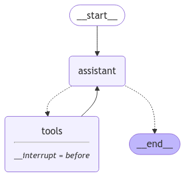

# ⏸️ Tema 3: Breakpoints – Control Total del Flujo  

## 🚀 ¿Qué son los Breakpoints en LangGraph?  

Los **breakpoints** en LangGraph son puntos de control que permiten **pausar el flujo de ejecución de un grafo** en momentos específicos.  
Esto brinda a los desarrolladores y sistemas:  
- **Flexibilidad:** Intervenir manualmente para validar, modificar o analizar datos.  
- **Control Dinámico:** Decidir si continuar, detener o reiniciar el flujo.  

---

## 🧠 ¿Por Qué Usar Breakpoints?  

1. **Validación en Tiempo Real:** Revisa los datos generados por el grafo antes de seguir con el flujo.  
2. **Intervención Manual:** Permite la participación humana en puntos críticos del grafo.  
3. **Depuración Avanzada:** Identifica y corrige errores durante la ejecución.  

---

## 🌟 ¿Cómo Funcionan los Breakpoints?  

Cuando un grafo alcanza un breakpoint:  
1. **El Flujo se Detiene:** Se pausa la ejecución en el nodo designado.  
2. **Acción del Usuario:** Se puede realizar cualquier validación o modificación necesaria, que profundizaremos en el siguiente tema.  
3. **Reanudación:** Una vez que se completa la intervención, el flujo puede continuar desde el punto en el que se detuvo.  

LangGraph permite implementar breakpoints mediante funciones personalizadas y configuraciones en el grafo.  

---

## 🛠️ Ejemplo Práctico: Implementando Breakpoints  

En este ejemplo práctico, configuraremos un grafo con un **breakpoint** que detenga su ejecución en un nodo específico. Esto nos permitirá inspeccionar y, si es necesario, modificar el estado del grafo antes de reanudar su flujo.  

---

### Paso 1: Configuración del Grafo con Breakpoints  

Partiremos de la calculadora que ya conocemos, y añadiremos un breakpoint para observar cómo se detiene el flujo.  


```python
[...]
# Importamos el MemorySaver
from langgraph.checkpoint.memory import MemorySaver
[...]
# Agregamos memoria a nuestro grafo.
memory = MemorySaver()
# Definimos `interrupt_before` para definir nuestro breakpoint antes de entrar a
# tools
calculadora = builder.compile(interrupt_before=["tools"], checkpointer=memory)
[...]
```



???+ Warning "Atención"

    Para habilitar los breakpoints en nuestro grafo, realizamos dos modificaciones clave:  

    - **Memoria (`MemorySaver`)**: Agregamos memoria al grafo para que pueda guardar su estado en el momento de la interrupción.  
    - **`interrupt_before`**: Definimos en qué punto del grafo queremos que se detenga. En este caso, configuramos el breakpoint justo antes de entrar al nodo `tools`. Alternativamente, podríamos usar (o combinar) `interrupt_after` para detener el flujo después de un nodo específico.  

---

### Paso 2: Invocamos el Grafo Hasta el Breakpoint

Para ejecutar el grafo hasta el breakpoint, utilizamos el método `stream`. Esto nos permite observar paso a paso cómo se comporta el grafo y analizar los datos en tiempo real.  

```python
# Input
initial_input = {"messages": HumanMessage(content="Me puedes resolver esta ecuación: (3+2)?")}

# Thread
thread = {"configurable": {"thread_id": "1"}}

# Run the graph until the first interruption
for event in calculadora.stream(initial_input, thread, stream_mode="values"):
    event['messages'][-1].pretty_print()
``` 

```python title="Resultado"
================================ Human Message =================================

Me puedes resolver esta ecuación: (3+2)?
================================== Ai Message ==================================
Tool Calls:
  sumar (call_pgbhFPo0DX2XYdHRcTpGD25t)
 Call ID: call_pgbhFPo0DX2XYdHRcTpGD25t
  Args:
    a: 3
    b: 2
```

???+ Note "Nota"

    El grafo se detiene exactamente en el punto que definimos, en este caso, antes de entrar al nodo `tools`.
    Esto nos permite:

    - Inspeccionar los datos que se pasarán a tools.
    - Realizar modificaciones o validaciones según sea necesario.

Además, podemos usar **`get_state`** para consultar el estado actual del grafo:

```python
state = calculadora.get_state(thread)
state.next
``` 

```python title="Resultado"
('tools',)
```

🔎 Aquí vemos que el grafo está detenido, esperando a que el nodo tools termine su tarea antes de proceder al siguiente nodo.

---

### Paso 3: Reanudar el Flujo desde el Breakpoint

Una vez que hemos realizado las validaciones o modificaciones necesarias, podemos reanudar el flujo del grafo desde el punto donde se detuvo.

???+ tip "Truco"
    
    Al invocar el grafo con **`None`** como entrada, LangGraph reanudará la ejecución automáticamente desde el último punto pausado.

```python
for event in calculadora.stream(None, thread, stream_mode="values"):
    event['messages'][-1].pretty_print() 
``` 

```python title="Resultado"
================================== Ai Message ==================================
Tool Calls:
  sumar (call_pgbhFPo0DX2XYdHRcTpGD25t)
 Call ID: call_pgbhFPo0DX2XYdHRcTpGD25t
  Args:
    a: 3
    b: 2
================================= Tool Message =================================
Name: sumar

5
================================== Ai Message ==================================

La solución de la ecuación (3 + 2) es 5.
```

El grafo se reanuda desde el último punto pausado, completa la ejecución del nodo tools, y continúa con el flujo hasta llegar al final.

???+ Note "Nota"

    - Al reanudar el grafo, LangGraph emitirá nuevamente el estado actual, incluyendo el mensaje con la llamada a la herramienta (`AIMessage`).  
    - Una vez ejecutado el nodo de la herramienta, el resultado se devuelve al modelo de chat, generando la respuesta final para el usuario.

---

## ✨ Conclusión

Los breakpoints ofrecen un nivel de control avanzado sobre el flujo del grafo, permitiéndonos:

- Detener la ejecución en puntos clave.
- Inspeccionar y modificar el estado del grafo.
- Reanudar el flujo de forma dinámica y eficiente.

Esta funcionalidad es especialmente útil en escenarios donde se requiere intervención manual, depuración, o validaciones intermedias.

---

## 🔄 Relación con el Streaming  

El concepto de breakpoints complementa el streaming al proporcionar un mecanismo para **interrumpir y reanudar flujos dinámicos**.  
Esto es particularmente útil en flujos en tiempo real, donde la interacción humana (`Human in the loop` que veremos en el siguiente tema) o la validación intermedia son críticas para el éxito del sistema.  

---

## 🔎 Recursos:

- :simple-googlecolab: Ver notebook en [Google Colab](https://colab.research.google.com/drive/1H30kGujfDL4GTDBuFzrkH6rPcArVxFsC?usp=sharing)
- :simple-googlecolab: Más ejemplos: [Google Colab](https://colab.research.google.com/github/langchain-ai/langchain-academy/blob/main/module-3/breakpoints.ipynb)
- :books: Definición del concepto: [Breakpoints](https://langchain-ai.github.io/langgraph/concepts/breakpoints/?h=brea)
- :books: How-to-guide: [Breakpoints](https://langchain-ai.github.io/langgraph/how-tos/human_in_the_loop/breakpoints/?h=brea)

---

## 🧑‍🏫 ¿Qué Hemos Aprendido?  

- **Breakpoints:** Puntos de pausa en el grafo para validar, modificar o intervenir en el flujo.  
- **Control del Flujo:** Cómo detener y reanudar un grafo de manera dinámica.  
- **Relación con Streaming:** Cómo integrar breakpoints con flujos en tiempo real para mayor flexibilidad.  

---

## 🌐 ¿Qué es lo Siguiente?  

En el próximo tema, exploraremos **Human in the Loop**, donde combinaremos todo lo aprendido para integrar intervención humana en flujos dinámicos y en tiempo real.  
