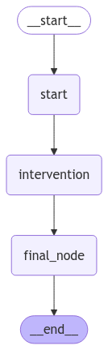

# 👩‍💻 Tema 4: Human in the Loop – Integración Humana en el Grafo  

## 🚀 ¿Qué es Human in the Loop?  

**Human in the Loop (HITL)** es un enfoque que permite combinar la **automatización** con la **intervención humana** en flujos de grafos.  
Con LangGraph, es posible integrar HITL para:  
- Revisar decisiones generadas automáticamente por el grafo.  
- Incorporar intervención humana en momentos críticos.  
- Proveer mayor control en aplicaciones sensibles o complejas.  

Es ideal para garantizar que las decisiones sean precisas, adaptadas al contexto y cumplan con los estándares esperados.  

---

## 🧠 ¿Por Qué es Importante Human in the Loop?  

1. **Validación de Resultados:** Permite revisar las decisiones del grafo antes de ejecutarlas.  
2. **Intervención Crítica:** Proporciona la flexibilidad necesaria para abordar casos complejos o sensibles.  
3. **Control Mejorado:** Combina lo mejor de los sistemas automatizados con la supervisión humana.  

Este enfoque crea sistemas más confiables, eficaces y personalizables.  

---

## 🌟 ¿Cómo Funciona Human in the Loop en LangGraph?  

LangGraph introduce HITL mediante **breakpoints**, eventos y lógica personalizada en los nodos.  
El flujo se detiene en puntos clave del grafo para permitir:  
1. Revisión de datos por parte del usuario.  
2. Modificación de parámetros o validaciones.  
3. Reanudación del flujo con los cambios realizados.  

---

## 🛠️ Ejemplo Práctico: Incorporando Human in the Loop  

En este ejemplo, configuramos un grafo que incluye un **nodo de intervención humana** para validar una acción antes de continuar.  

---

### Paso 1: Configuración del Grafo con Intervención Humana  

El primer paso es definir un grafo con nodos que permitan:  
- Procesar la entrada inicial.  
- Detenerse en un punto crítico para solicitar intervención humana.  
- Continuar el flujo según la respuesta recibida.  

```python hl_lines="20"
from langgraph.graph import StateGraph, START, END
from langchain_core.messages import HumanMessage, AIMessage
from langgraph.checkpoint.memory import MemorySaver
from langgraph.types import Command, interrupt
from typing_extensions import TypedDict

class State(TypedDict):
    input: str
    user_feedback: str
    respuesta: str

# Nodo de procesamiento inicial
def initial_node(state):
    print("---Nodo inicial: procesando datos.---")
    return state

# Nodo de intervención humana
def human_intervention(state):
    print("---⏸️ Intervención humana requerida.---")
    feedback = interrupt("Deseas validar esta acción?: (SI/NO)")
    return {"user_feedback": feedback}  # Aquí el humano puede validar o modificar el estado

# Nodo de continuación
def final_node(state):
    print("---▶️ Nodo final: completando el flujo.---")
    if state["user_feedback"] == "SI":
        state["respuesta"] = "El usuario ha validado la acción"
    else:
        state["respuesta"] = "El usuario NO ha validado la acción"
    return state

# Configuración del grafo
builder = StateGraph(State)
builder.add_node("start", initial_node)
builder.add_node("intervention", human_intervention)
builder.add_node("final_node", final_node)

builder.add_edge(START, "start")
builder.add_edge("start", "intervention")
builder.add_edge("intervention", "final_node")
builder.add_edge("final_node", END)

memory = MemorySaver()
# Compilar el grafo
graph_with_hitl = builder.compile(checkpointer=memory)

from IPython.display import Image, display
display(Image(graph_with_hitl.get_graph(xray=True).draw_mermaid_png()))
```  



???+ Note "Nota"

    En este ejemplo:  
    - Usamos el método `interrupt` para pausar el flujo en el nodo de intervención.  
    - Integramos una memoria persistente (`MemorySaver`) para garantizar que el grafo recuerde su estado durante las interrupciones.  


---

### Paso 2: Pausando el Grafo para la Intervención  

Cuando ejecutamos el grafo, este se detiene en el nodo de intervención humana, enviando un mensaje al usuario para validar la acción.   

```python
initial_input = {"input": "Felicitar a Raul por el curso."}
thread = {"configurable": {"thread_id": "1"}}

events = []

# Ejecutamos el grafo hasta el punto de intervención
for event in graph_with_hitl.stream(initial_input, thread, stream_mode="updates"):
    print(event)
    events.append(event)
    print("\n")
```

```python title="Resultado" hl_lines="5"
---Nodo inicial: procesando datos.---
{'start': {'input': 'Felicitar a Raul por el curso.'}}

---⏸️ Intervención humana requerida.---
{'__interrupt__': (Interrupt(value='Deseas validar esta acción?: (SI/NO)', resumable=True, ns=['intervention:81d7c2a0-7cc5-cdd4-a7d9-aeedd3aa2944'], when='during'),)}
```

El grafo responde con un objeto **`Interrupt`**, que contiene el mensaje para el usuario.  
Podemos mostrar este mensaje usando el siguiente fragmento:  

```python 
# Mostramos el mensaje de nuestro Interrupt.
for event in events:
    if '__interrupt__' in event:  # Verificamos si el evento tiene un '__interrupt__'
        interrupt_obj = event['__interrupt__'][0]  # Obtenemos el objeto Interrupt           
        # Formateamos y mostramos la información
        formatted_output = f"Interrupt Message: {interrupt_obj.value}"
        print(formatted_output.strip())
```

```python title="Resultado"
Interrupt Message: Deseas validar esta acción?: (SI/NO)
```

???+ Note "Nota"

    Este punto es esencial para integrar la intervención humana en tu aplicación, ya que el mensaje de `Interrupt` es lo que el sistema envía al usuario para interactuar.  


---

### Paso 3: Comprobando el estado actual

Para asegurarnos de que el grafo está detenido correctamente en el nodo esperado, podemos consultar su estado con `get_state`:  

```python 
# Comprobamos que realmente esta pendiente de intervención.
state = graph_with_hitl.get_state(thread)
state.next
```

```python title="Resultado"
('intervention',)
```

Esto confirmará que el grafo está bloqueado en el nodo `intervention`, esperando la respuesta del usuario.  

---

### Paso 4: Reanudando el Flujo Tras la Intervención  

Después de que el usuario responde a la consulta, reanudamos el flujo desde el punto donde se detuvo.  


```python hl_lines="4"
# Continuamos con la ejecución del grafo agregando nuestra respuesta.
# Podeis probar respondiendo un "NO" para ver el caso contrario.
#for event in graph_with_hitl.stream(Command(resume="NO"), thread, stream_mode="updates"):
for event in graph_with_hitl.stream(Command(resume="SI"), thread, stream_mode="updates"):
    print(event)
    events.append(event)
    print("\n")
```

```python title="Resultado" hl_lines="2"
---⏸️ Intervención humana requerida.---
{'intervention': {'user_feedback': 'SI'}}


---▶️ Nodo final: completando el flujo.---
{'final_node': {'input': '¿Esta decisión es correcta?', 'user_feedback': 'SI', 'respuesta': 'El usuario ha validado la acción'}}
```

💡 **Truco:** Usamos el objeto **`Command`** para enviar la respuesta del usuario al grafo, lo que permite continuar el flujo.  


???+ Note "Nota"

    La integración de HITL en una aplicación requiere considerar dos puntos clave:  
    1. **Inicio del Flujo:** Inicia el grafo con la entrada del usuario.  
    2. **Continuación del Flujo:** Reanuda el grafo desde donde se detuvo, enviando la respuesta del usuario.  

    Esto implica que tu aplicación debe tener dos endpoints para interactuar con el grafo:  
    - **Endpoint Inicial:** Para iniciar el flujo (por ejemplo, `miapp.com/start`).  
    - **Endpoint Continuación:** Para reanudar el flujo tras la intervención (por ejemplo, `miapp.com/continue`).  


---

## 🎯 Casos de Uso Reales  

- **Revisión de Decisiones Automatizadas:** Garantizar que las decisiones cumplen con estándares antes de ejecutarlas.  
- **Procesos Empresariales Sensibles:** Validación humana en flujos que manejan datos financieros o legales.  
- **Personalización:** Incorporar preferencia o experiencia humana para mejorar la experiencia del usuario.  

---

## 🧑‍🏫 ¿Qué Hemos Aprendido?  

- **Human in the Loop:** Cómo integrar intervención humana en un grafo automatizado.  
- **Intervención Dinámica:** Detener el flujo, solicitar validaciones y reanudar según las respuestas recibidas.  
- **Aplicación Práctica:** Implementar control humano en flujos críticos y mejorar la confiabilidad de los sistemas automatizados.  

---

## ✨ Conclusión

**Human in the Loop (HITL)** es una funcionalidad esencial para equilibrar la automatización y el control humano en flujos de trabajo complejos.  
A lo largo de este tema, hemos visto cómo LangGraph permite integrar puntos de intervención humana para garantizar:  
- **Decisiones Validas:** Validación de resultados automatizados en tiempo real.  
- **Flexibilidad Dinámica:** Capacidad de detener, modificar y reanudar flujos según las necesidades del usuario.  
- **Control Personalizado:** Mayor confiabilidad en procesos críticos o sensibles.  

HITL no solo mejora la precisión de los sistemas automatizados, sino que también los hace más adaptables y orientados al usuario, permitiendo una colaboración más eficiente entre humanos y tecnología.  

---

## 🔎 Recursos:

- :simple-googlecolab: Ver notebook en [Google Colab](https://colab.research.google.com/drive/1oojOt7XIHfURcWHXoWZuhGrvy00UReFS?usp=sharing)
- :simple-googlecolab: Ejemplo avanzado para pedir permiso al usuario de uso de herramientas: [Google Colab](https://colab.research.google.com/drive/1h6njIRHU4tLk0OlJDpkd2YNYybZ5wX8F?usp=sharing)
- :books: Definición del concepto: [Human-in-the-loop](https://langchain-ai.github.io/langgraph/concepts/human_in_the_loop/?h=huma)
- :books: How-to-guide: [Humman-approval](https://python.langchain.com/docs/how_to/tools_human/#adding-human-approval)

---

## 🌐 ¿Qué es lo Siguiente?  

En el próximo tema, exploraremos **Paralelismo**, una técnica clave para optimizar flujos mediante la ejecución simultánea de nodos. Veremos cómo dividir tareas en paralelo, consolidar resultados y mejorar la eficiencia en grafos complejos.  

