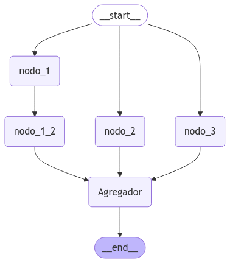

# 🚀 Tema 5: Paralelismo – Ejecutando Nodos Simultáneamente  

## 🌟 ¿Qué es el Paralelismo en LangGraph?  

El **paralelismo** en LangGraph permite que múltiples nodos se ejecuten simultáneamente dentro del mismo grafo.  
Esto es especialmente útil en situaciones donde:  

- Existen tareas independientes que pueden ejecutarse en paralelo.  
- Se busca **optimizar el rendimiento** y reducir el tiempo de ejecución.  
- Queremos aprovechar mejor los **recursos computacionales** sin sacrificar la estructura del flujo.  

Al permitir que varias operaciones se realicen al mismo tiempo, el paralelismo convierte un grafo en una herramienta **más rápida y eficiente**.  

---

## 🧠 ¿Por Qué es Importante el Paralelismo?  

1. **Eficiencia:** Reduce el tiempo total de ejecución al permitir múltiples procesos concurrentes.  
2. **Escalabilidad:** Facilita la ejecución de tareas en paralelo, lo que es clave en flujos de trabajo complejos.  
3. **Modularidad:** Permite separar diferentes procesos sin afectar la lógica general del grafo.  

Al aprovechar estas ventajas, podemos diseñar sistemas más flexibles y de alto rendimiento.  

---

## 🌟 ¿Cómo Funciona el Paralelismo en LangGraph?  

LangGraph gestiona el paralelismo mediante **nodos paralelos**, que permiten que múltiples procesos se ejecuten simultáneamente.  

- **Los subnodos se ejecutan en paralelo** y devuelven resultados independientes.  
- **Los resultados de los subnodos se consolidan** en el estado global del grafo.  

Para implementar esto, utilizamos el **ParallelNode**, una herramienta integrada en LangGraph específicamente diseñada para gestionar la ejecución simultánea de nodos.  

---

## 🛠️ Ejemplo Práctico: Implementando Paralelismo  

A continuación, configuraremos un grafo con varios nodos que se ejecutarán en paralelo.  

### Paso 1: Definición de los Nodos y el Estado  

Creamos un conjunto de nodos que realizarán tareas simultáneamente y generarán resultados independientes.  

```python 
from langgraph.graph import StateGraph, START, END, MessagesState
from typing import Annotated, Any
from typing_extensions import TypedDict
import operator


class State(TypedDict):
    aggregate: str

def nodo_1(state: State):
    return {"aggregate": ["---NODO_1---"]}

def nodo_1_2(state: State):
    return {"aggregate": ["---NODO_1_2---"]}

def nodo_2(state: State):
    return {"aggregate": ["---NODO_2---"]}

def nodo_3(state: State):
    return {"aggregate": ["---NODO_3---"]}

def aggregator(state: State):
    return {"aggregate": ["---AGREGADOR---"]}
```


---

### Paso 2: Prueba 1 - Intento sin un Agregador  

Si intentamos ejecutar el grafo sin un **reducer**, se generará un error debido a la **escritura concurrente** en el mismo estado.  


```python hl_lines="16 17 18"
# Build workflow
parallel_builder = StateGraph(State)

# Add nodes
parallel_builder.add_node("nodo_1", nodo_1)
parallel_builder.add_node("nodo_1_2", nodo_1_2)
parallel_builder.add_node("nodo_2", nodo_2)
parallel_builder.add_node("nodo_3", nodo_3)
parallel_builder.add_node("Agregador", aggregator)

# Add edges to connect nodes
parallel_builder.add_edge(START, "nodo_1")
parallel_builder.add_edge(START, "nodo_2")
parallel_builder.add_edge(START, "nodo_3")
parallel_builder.add_edge("nodo_1", "nodo_1_2")
parallel_builder.add_edge("nodo_1_2", "Agregador")
parallel_builder.add_edge("nodo_2", "Agregador")
parallel_builder.add_edge("nodo_3", "Agregador")
parallel_builder.add_edge("Agregador", END)
parallel_workflow = parallel_builder.compile()

# Show workflow
from IPython.display import Image, display
display(Image(parallel_workflow.get_graph().draw_mermaid_png()))
```


Invocamos nuestro grafo para ver nuestra primera prueba a ver que pasa.

```python
# Invoke
from langgraph.errors import InvalidUpdateError
try:
    state = parallel_workflow.invoke({"aggregate": []})
except InvalidUpdateError as e:
    print(f"An error occurred: {e}")
```

```python title="Resultado"
An error occurred: At key 'aggregate': Can receive only one value per step. Use an Annotated key to handle multiple values.
For troubleshooting, visit: https://python.langchain.com/docs/troubleshooting/errors/INVALID_CONCURRENT_GRAPH_UPDATE
``` 

???+ Note "Nota"

    El error ocurre porque varios nodos intentan modificar la misma clave en el estado al mismo tiempo.
    LangGraph no sabe cuál de los valores conservar, lo que provoca un conflicto.

---

### Paso 3: Prueba 2 - Añadiendo un Reducer

Para solucionar este problema, añadimos un reducer que gestione la actualización del estado de manera estructurada.

```python hl_lines="3"
# Agregamos un reducer al state
class State(TypedDict):
    aggregate: Annotated[list, operator.add]

# Build workflow
parallel_builder = StateGraph(State)

# Add nodes
parallel_builder.add_node("nodo_1", nodo_1)
parallel_builder.add_node("nodo_1_2", nodo_1_2)
parallel_builder.add_node("nodo_2", nodo_2)
parallel_builder.add_node("nodo_3", nodo_3)
parallel_builder.add_node("Agregador", aggregator)

# Add edges to connect nodes
parallel_builder.add_edge(START, "nodo_1")
parallel_builder.add_edge(START, "nodo_2")
parallel_builder.add_edge(START, "nodo_3")
parallel_builder.add_edge("nodo_1", "nodo_1_2")
parallel_builder.add_edge("nodo_1_2", "Agregador")
parallel_builder.add_edge("nodo_2", "Agregador")
parallel_builder.add_edge("nodo_3", "Agregador")
parallel_builder.add_edge("Agregador", END)
parallel_workflow = parallel_builder.compile()

state = parallel_workflow.invoke({"aggregate": []})
print(state)
```

```python title="Resultado"
{'aggregate': ['---NODO_1---', '---NODO_2---', '---NODO_3---', '---AGREGADOR---', '---NODO_1_2---', '---AGREGADOR---']}
```

???+ Note "Nota"

    Ahora el flujo se ejecuta correctamente, pero si observamos detenidamente los resultados, podemos notar que:

    - El nodo Agregador se ejecuta dos veces.
    - nodo_1_2 aparece en un momento inesperado dentro de la ejecución.

    Esto indica que todavía podemos mejorar el orden del flujo.

---

### Paso 4: Prueba 3 - Asegurar que los Nodos Terminen Antes de Avanzar

El siguiente paso es garantizar que el nodo Agregador solo se ejecute después de que todos los nodos paralelos hayan completado su trabajo.

```python hl_lines="20"
# Agregamos un reducer al state
class State(TypedDict):
    aggregate: Annotated[list, operator.add]

# Build workflow
parallel_builder = StateGraph(State)

# Add nodes
parallel_builder.add_node("nodo_1", nodo_1)
parallel_builder.add_node("nodo_1_2", nodo_1_2)
parallel_builder.add_node("nodo_2", nodo_2)
parallel_builder.add_node("nodo_3", nodo_3)
parallel_builder.add_node("Agregador", aggregator)

# Add edges to connect nodes
parallel_builder.add_edge(START, "nodo_1")
parallel_builder.add_edge(START, "nodo_2")
parallel_builder.add_edge(START, "nodo_3")
parallel_builder.add_edge("nodo_1", "nodo_1_2")
parallel_builder.add_edge(["nodo_1_2","nodo_2","nodo_3"], "Agregador")
parallel_builder.add_edge("Agregador", END)
parallel_workflow = parallel_builder.compile()

state = parallel_workflow.invoke({"aggregate": []})
print(state)
```

```python title="Resultado"
{'aggregate': ['---NODO_1---', '---NODO_2---', '---NODO_3---', '---NODO_1_2---', '---AGREGADOR---']}
``` 

???+ Note "Nota"

    Hemos asegurado que el nodo **`Agregador`** no se ejecute hasta que todos los nodos anteriores hayan finalizado su tarea.

    Sin embargo, el orden de ejecución de los nodos paralelos sigue siendo indeterminado, lo que podría causar incoherencias en ciertos casos.

---

### Paso 5: Prueba 4 - Definir un Orden de Ejecución

Dado que dentro de cada nodo no tenemos control específico sobre el orden de actualización del estado, LangGraph determina un orden determinista basado en la topología del grafo.

Si necesitamos un control más preciso, podemos crear un reducer personalizado que organice las actualizaciones en un orden predefinido.

```python hl_lines="2-22 26"
# Definimos un orden manual 
ORDERED_NODES = [
    "---NODO_1---",
    "---NODO_1_2---",
    "---NODO_2---",
    "---NODO_3---",
    "---AGREGADOR---"
]

def custom_order_reducer(left, right):
    """ Combina los valores y los ordena en el orden predefinido en ORDERED_NODES """
    if not isinstance(left, list):
        left = [left]

    if not isinstance(right, list):
        right = [right]

    # Combinamos los valores eliminando duplicados y preservando el orden de aparición
    combined = list(dict.fromkeys(left + right)) 

    # Ordenamos la lista según ORDERED_NODES
    return sorted(combined, key=lambda x: ORDERED_NODES.index(x) if x in ORDERED_NODES else float('inf'))

# Agregamos un reducer al state
class State(TypedDict):
    aggregate: Annotated[list, custom_order_reducer]

# Build workflow
parallel_builder = StateGraph(State)

# Add nodes
parallel_builder.add_node("nodo_1", nodo_1)
parallel_builder.add_node("nodo_1_2", nodo_1_2)
parallel_builder.add_node("nodo_2", nodo_2)
parallel_builder.add_node("nodo_3", nodo_3)
parallel_builder.add_node("Agregador", aggregator)

# Add edges to connect nodes
parallel_builder.add_edge(START, "nodo_1")
parallel_builder.add_edge(START, "nodo_2")
parallel_builder.add_edge(START, "nodo_3")
parallel_builder.add_edge("nodo_1", "nodo_1_2")
parallel_builder.add_edge(["nodo_1_2","nodo_2","nodo_3"], "Agregador")
parallel_builder.add_edge("Agregador", END)
parallel_workflow = parallel_builder.compile()

state = parallel_workflow.invoke({"aggregate": []})
print(state)
```

```python title="Resultado"
{'aggregate': ['---NODO_1---', '---NODO_1_2---', '---NODO_2---', '---NODO_3---', '---AGREGADOR---']}
```

???+ Note "Nota"

    - Implementamos un orden manual de ejecución con un reducer personalizado.
    - Ahora los nodos se ejecutan en el orden deseado, asegurando la coherencia del flujo.

---

## ✨ Conclusión

El paralelismo en LangGraph es una técnica fundamental para optimizar flujos de trabajo y reducir tiempos de ejecución.

- Nos permite ejecutar múltiples tareas simultáneamente, maximizando el uso de recursos.
- A través de los reducers, podemos gestionar conflictos en la actualización del estado.
- Si es necesario, podemos definir manualmente el orden de ejecución para garantizar coherencia en los resultados.

Dominar el paralelismo nos permite construir grafos más eficientes, escalables y adaptables a flujos de trabajo complejos.

---

## 🎯 Casos de Uso Reales

1. **Procesamiento de Datos en Paralelo:** Dividir grandes volúmenes de datos en tareas más pequeñas y manejarlas simultáneamente.
2. **Consultas Concurrentes:** Realizar múltiples consultas a bases de datos o APIs al mismo tiempo.
3. **Flujos de Trabajo Empresariales:** Manejar tareas independientes en sistemas complejos, como soporte técnico y ventas en paralelo.

---

## 🧑‍🏫 ¿Qué Hemos Aprendido?

- **Paralelismo en LangGraph:** Cómo ejecutar nodos simultáneamente para optimizar flujos de trabajo.
- **ParallelNode:** Herramienta clave para implementar tareas en paralelo dentro de un grafo.
- **Consolidación de Resultados:** Cómo combinar los resultados de nodos paralelos para continuar el flujo.

---

## 🔎 Recursos:

- :simple-googlecolab: Ver notebook en [Google Colab](https://colab.research.google.com/drive/1XKWzkSHs-k5RPhr_fN4IgAla8eC7cuqu?usp=sharing)
- :simple-googlecolab: Más ejemplos: [Google Colab](https://colab.research.google.com/github/langchain-ai/langchain-academy/blob/main/module-4/parallelization.ipynb)
- :books: Definición del concepto: [Parallelism](https://langchain-ai.github.io/langgraph/tutorials/workflows/?h=paralle#parallelization)
- :books: How-to-guide: [Parallelism](https://langchain-ai.github.io/langgraph/how-tos/branching/)

--- 

## 🌐 ¿Qué es lo Siguiente?

En el próximo tema, exploraremos **Sub-Graphs**, una técnica avanzada que permite dividir grafos grandes en secciones más pequeñas y manejables.