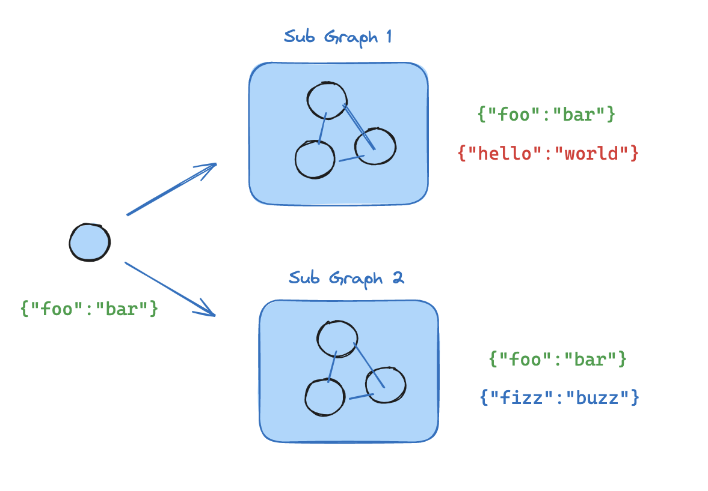
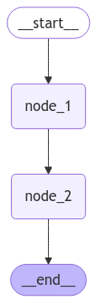
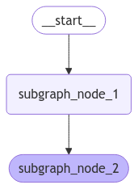

# 🔗 Tema 7: Subgraphs – Modularizando Grafos en LangGraph  

## 🌟 ¿Qué es un Subgraph en LangGraph?  

Un **Subgraph** en LangGraph es un grafo **independiente** que puede integrarse dentro de un grafo principal como si fuera un nodo más.  
Esto permite dividir flujos complejos en secciones más pequeñas y reutilizables.  



Los subgrafos son útiles para:  
- **Modularizar flujos de trabajo grandes** y hacerlos más manejables.  
- **Reutilizar lógica en diferentes partes del grafo.**  
- **Mejorar la legibilidad y mantenimiento del código.**  

Con esta técnica, podemos construir flujos más organizados y eficientes.  

---

## 🧠 ¿Por Qué Usar Subgraphs?  

1. **Reutilización de Código:** Permite definir procesos independientes y reutilizarlos en distintos grafos.  
2. **Escalabilidad:** Ayuda a estructurar flujos complejos en partes más manejables.  
3. **Mantenimiento y Legibilidad:** Hace que los grafos sean más fáciles de entender y modificar.  

En proyectos grandes, dividir el flujo en subgrafos facilita la depuración y la expansión del sistema.  

---

## 🛠️ Ejemplo Práctico: Implementando un Subgraph  

A continuación, crearemos un **subgrafo** que se ejecutará dentro de un **grafo principal**.  

---

### Paso 1: Creación del Subgraph  

Definimos un subgrafo con dos nodos que trabajan con una parte específica del estado.  

```python
from langgraph.graph import START, StateGraph, END
from typing import TypedDict

# ---- Definimos el subgraph ----
class SubgraphState(TypedDict):
    foo: str  # note that this key is shared with the parent graph state
    bar: str


def subgraph_node_1(state: SubgraphState):
    print("---SUBGRAPH 1---")
    return {"bar": "bar"}


def subgraph_node_2(state: SubgraphState):
    print("---SUBGRAPH 2---")
    # Nota: este nodo está utilizando una clave de estado (`bar`) que solo está disponible dentro del subgrafo  
    # y está enviando una actualización a la clave de estado compartida (`foo`). 
    return {"foo": state["foo"] + state["bar"]}

subgraph_builder = StateGraph(SubgraphState)
subgraph_builder.add_node(subgraph_node_1)
subgraph_builder.add_node(subgraph_node_2)
subgraph_builder.add_edge(START, "subgraph_node_1")
subgraph_builder.add_edge("subgraph_node_1", "subgraph_node_2")
subgraph = subgraph_builder.compile()
# ---- Fin Definición del subgraph ----
```

???+ Note "Nota"

    - `SubgraphState` define un State especifico para el subgrafo.
    - `subgraph_node_1` introduce una nueva clave de estado (`bar`).  
    - `subgraph_node_2` usa `bar` y modifica el estado compartido con el grafo principal (`foo`).  

    Este subgrafo puede utilizarse en cualquier otro flujo sin necesidad de reescribir su lógica.  


---

### Paso 2: Integración del Subgraph en el Grafo Principal  

Ahora que tenemos el subgrafo listo, lo añadimos al **grafo principal** como si fuera un nodo más.  

```python hl_lines="12"
# ---- Definimos el grafo princial ----
class ParentState(TypedDict):
    foo: str

def node_1(state: ParentState):
    print ("---NODE 1---")
    return {"foo": "hi! " + state["foo"]}

builder = StateGraph(ParentState)
builder.add_node("node_1", node_1)
# Agregamos el subgraph compliado previamnete como si fuese un nodo.
builder.add_node("node_2", subgraph)
builder.add_edge(START, "node_1")
builder.add_edge("node_1", "node_2")
builder.add_edge("node_2", END)
graph = builder.compile()

# ---- Fin Definición del grafo principal ----
```

???+ Note "Nota"

    - `ParentState` define el State principal de nuestro grafo.
    - `node_1` inicializa el estado antes de pasar el control al subgrafo.  
    - `subgraph` se integra en el flujo sin necesidad de definir nuevamente sus nodos internos.  
    - LangGraph **gestiona automáticamente la transición de estado** entre el grafo principal y el subgrafo.  

---

### Paso 3: Visualización del Grafo  

Podemos generar una visualización del grafo maestro para entender mejor la estructura de nodos y conexiones.  

```python
from IPython.display import Image, display
display(Image(graph.get_graph(xray=True).draw_mermaid_png()))
```



???+ Note "Nota"
    
    En la imagen generada, vemos cómo el subgrafo aparece integrado dentro del grafo principal como si fuera un nodo corriente.  

Y aquí podemos visualizar el sub-grafo con todos sus nodos.

```python
from IPython.display import Image, display
display(Image(subgraph.get_graph(xray=True).draw_mermaid_png()))
```



---

### Paso 4: Ejecución del Grafo  

Al ejecutar el grafo, podemos invocarlo de dos formas:  

1. **Sin mostrar la estructura del subgraph:**  

    - Se muestra el flujo general, pero sin detallar la ejecución interna del subgrafo.  

    ```python 
    for chunk in graph.stream({"foo": "foo"}):
         print(chunk)
    ```

    ```python title="Resultado"
    ---NODE 1---
    {'node_1': {'foo': 'hi! foo'}}
    ---SUBGRAPH 1---
    ---SUBGRAPH 2---
    {'node_2': {'foo': 'hi! foobar'}}
    ```

2. **Mostrando la estructura del subgraph:**  

    - Se pueden ver los nodos internos del subgrafo a medida que se ejecutan.  

    ```python hl_lines="1"
    for chunk in graph.stream({"foo": "foo"}, subgraphs=True):
         print(chunk)
    ```

    ```python title="Resultado"
    ---NODE 1---
    ((), {'node_1': {'foo': 'hi! foo'}})
    ---SUBGRAPH 1---
    ---SUBGRAPH 2---
    (('node_2:24a9cba2-16e4-3b12-bfd7-9eaedb63e5fd',), {'subgraph_node_1': {'bar': 'bar'}})
    (('node_2:24a9cba2-16e4-3b12-bfd7-9eaedb63e5fd',), {'subgraph_node_2': {'foo': 'hi! foobar'}})
    ((), {'node_2': {'foo': 'hi! foobar'}})
    ```

???+ Note "Nota"

    Si activamos la opción `subgraphs=True`, podemos inspeccionar la ejecución del subgrafo como una parte separada dentro del flujo.  

---

## 🔄 Otras Formas de Usar un Subgraph  

En el ejemplo anterior, vimos cómo integrar un **subgrafo** dentro de un grafo principal agregándolo como un nodo. Esta es la forma más sencilla de utilizar subgrafos, pero en flujos más complejos, puede ser necesario **invocarlos manualmente** dentro de un nodo en lugar de tratarlos como un nodo independiente.  

LangGraph permite esta opción, ya que al compilar un subgrafo, este se convierte en un **objeto invocable**. Veamos cómo podemos hacerlo:  


```python hl_lines="3"
def node_2(state: ParentState):
    # transform the state to the subgraph state
    response = subgraph.invoke({"bar": state["foo"]})
    # transform response back to the parent state
    return {"foo": response["bar"]}
```

💡 Explicación:

- Creamos un nodo que **invoca manualmente** al subgrafo.
- Pasamos los datos en el formato que requiere el subgrafo (bar).
- Recibimos la respuesta y la adaptamos al estado del grafo principal (foo).

???+ Note "Nota"
    
    Este enfoque nos permite ejecutar subgrafos de manera más flexible, integrándolos en flujos más dinámicos sin necesidad de tratarlos siempre como nodos individuales.

---

## ✨ Conclusión  

Los **subgraphs** nos permiten dividir flujos complejos en módulos reutilizables, lo que mejora la **escalabilidad, legibilidad y mantenimiento** del código.  

- Facilitan la **modularización** al permitir la reutilización de lógica en distintos grafos.  
- Mejoran la **organización del código**, evitando estructuras monolíticas difíciles de mantener.  
- Nos permiten **inspeccionar su ejecución** de manera independiente si es necesario.  

En definitiva, los subgrafos son una herramienta clave para el diseño de **grafos escalables y eficientes** en LangGraph.  

---

## 🎯 Casos de Uso Reales  

1. **Modularización de Procesos:** Separar distintas partes de un flujo complejo en módulos reutilizables.  
2. **Gestión de Tareas Repetitivas:** Reutilizar subgrafos en distintos puntos del flujo sin duplicar código.  
3. **Depuración y Optimización:** Inspeccionar la ejecución de secciones específicas del grafo sin afectar el resto.  

---

## 🧑‍🏫 ¿Qué Hemos Aprendido?  

- **Cómo definir un subgrafo** en LangGraph.  
- **Cómo integrarlo dentro de un grafo principal** como si fuera un nodo.  
- **Cómo visualizar y ejecutar grafos con subgrafos** de manera flexible.  

---

## 🔎 Recursos:

- :simple-googlecolab: Ver notebook en [Google Colab](https://colab.research.google.com/drive/1R3jh6ekTuBFLcZj94amBtpHPBQyayB0T?usp=sharing)
- :books: Definición del concepto: [Subgraphs](https://langchain-ai.github.io/langgraph/concepts/low_level/#subgraphs)
- :books: How-to-guide: [Subgraphs](https://langchain-ai.github.io/langgraph/how-tos/subgraph/)

--- 

## 🌐 ¿Qué es lo Siguiente?  

En el próximo tema, exploraremos **Mapas**, una técnica avanzada que permite distribuir información entre múltiples nodos de manera eficiente.  
