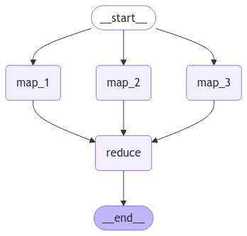

# :octicons-git-branch-24:{ .icon-title-main } Tema 7: Map-Reduce – Distribuyendo y Procesando Datos en LangGraph  

## 🌟 ¿Qué es el Patrón Map-Reduce en LangGraph?  

La técnica **Map-Reduce** es una técnica que permite dividir una tarea en múltiples subtareas independientes (**Map**) y luego consolidar sus resultados en un solo valor final (**Reduce**).  

En LangGraph, este patrón es especialmente útil cuando:  
- Necesitamos **procesar grandes volúmenes de datos** en paralelo.  
- Queremos dividir una tarea compleja en partes más pequeñas y manejables.  
- Buscamos **optimizar el rendimiento** evitando bloqueos en el flujo de ejecución.  

---

## 🧠 ¿Por Qué Usar Map-Reduce?  

1. **Eficiencia:** Permite distribuir la carga de trabajo entre varios nodos en paralelo.  
2. **Escalabilidad:** Facilita el manejo de tareas que crecen en complejidad y volumen de datos.  
3. **Flexibilidad:** Puede aplicarse a una gran variedad de problemas, desde el procesamiento de texto hasta análisis de datos.  

Este patrón es clave cuando trabajamos con sistemas que necesitan **procesar información a gran escala** sin perder rendimiento.  

---

## 🛠️ Ejemplo Práctico: Implementando Map-Reduce  

En este ejemplo, crearemos un grafo que:  
1. **Distribuye datos entre múltiples nodos de procesamiento (Map).**  
2. **Recoge y consolida los resultados en un nodo final (Reduce).**  

---

### Paso 1: Configuración del Estado  

Definimos el estado inicial del grafo, asegurándonos de que pueda manejar múltiples resultados de manera eficiente.  

```python
from langgraph.graph import StateGraph, START, END
from typing import TypedDict, Annotated
from typing_extensions import TypedDict
import operator

# Definimos el estado del grafo
class State(TypedDict):
    datos: list[str]  # Datos a procesar en la fase Map
    resultados: Annotated[list[str], operator.add]  # Resultados consolidados en Reduce
```  

???+ Note "Nota"

    **Los datos se dividen en partes más pequeñas**, permitiendo que cada nodo procese solo una porción de la información.  

---

### Paso 2: Implementación de la Fase "Map"  

Cada nodo en la fase **Map** procesa una parte de los datos de forma independiente.  

```python
# Definimos los nodos de la fase "Map"
def procesar_dato_1(state: State):
    return {"resultados": [f"Procesado: {state['datos'][0]}"]}

def procesar_dato_2(state: State):
    return {"resultados": [f"Procesado: {state['datos'][1]}"]}

def procesar_dato_3(state: State):
    return {"resultados": [f"Procesado: {state['datos'][2]}"]}
```

???+ Note "Nota" 

    **Ventaja del Paralelismo:** Cada nodo se ejecuta **simultáneamente**, acelerando el tiempo total de procesamiento.  

---

### Paso 3: Implementación de la Fase "Reduce"  

Los resultados generados en la fase **Map** se consolidan en un único valor final en la fase **Reduce**.  

```python
# Definimos el nodo de la fase "Reduce"
def combinar_resultados(state: State):
    # Analizariamos los datos procesados y mostrariamos un resultado final.
    return {"resultados": state["resultados"] + ["Resultado Final"]}
```

???+ Note "Nota" 

    **¿Cómo Funciona el Reducer?**  
    - **Recoge los resultados individuales** de cada nodo.  
    - **Los combina en una única salida final** que representa la información procesada.  

---

### Paso 4: Visualización del Grafo  

Podemos representar el flujo de ejecución para ver cómo los datos se transforman en cada etapa.  

```python
from IPython.display import Image, display

# Construimos el grafo
builder = StateGraph(State)

# Agregamos los nodos
builder.add_node("map_1", procesar_dato_1)
builder.add_node("map_2", procesar_dato_2)
builder.add_node("map_3", procesar_dato_3)
builder.add_node("reduce", combinar_resultados)

# Definimos el flujo de ejecución
builder.add_node("map_1", procesar_dato_1)
builder.add_node("map_2", procesar_dato_2)
builder.add_node("map_3", procesar_dato_3)
# Nos aseguramos que todos los nodos han terminado el procesamiento de datos.
# Tal y como vimos en el tema de 'paralelismos'
builder.add_edge(["map_1", "map_2", "map_3"], "reduce")
builder.add_edge("reduce", END)

# Compilamos el grafo
graph = builder.compile()

# Mostramos la visualización del grafo
display(Image(graph.get_graph().draw_mermaid_png()))
```



🔍 En la imagen generada, se puede observar claramente la distribución de datos en múltiples nodos antes de su consolidación final.  

---

### Paso 5: Ejecución del Grafo  

Finalmente, ejecutamos el grafo para ver cómo se procesan los datos en las diferentes fases.  

```python
# Ejecutamos el grafo con datos de entrada
input_data = {"datos": ["Dato 1", "Dato 2", "Dato 3"], "resultados": []}
resultado_final = graph.invoke(input_data)

print(resultado_final)
```

```python title="Salida esperada"
{
  "resultados": ["Resultado 1", "Resultado 2", "Resultado 3", "Resultado Final"]
}
```

💡 ¿Qué Observamos?

- Cada dato se procesó de manera independiente en los nodos Map.
- Los resultados individuales se agruparon en un único valor final en el nodo Reduce.

---

## ✨ Conclusión  

La técnica **Map-Reduce** nos permite aplicar de manera práctica varios conceptos clave que hemos aprendido en este curso, como **paralelismo** y **reducers**. Además, podemos llevar esta técnica aún más lejos incorporando funcionalidades avanzadas como **Human in the Loop (HITL)** o llamadas a modelos de lenguaje (LLMs).  

El propósito principal de esta técnica es **dividir una entrada compleja en múltiples tareas independientes** para **procesarlas de manera óptima y consolidar los resultados de forma eficiente**.  

Un ejemplo práctico de Map-Reduce en el mundo real podría ser un **análisis de sentimiento en redes sociales**, donde podemos analizar miles de `tweets` en paralelo y luego unificarlos en un resultado final que refleje el sentimiento general sobre un tema.  

En resumen, Map-Reduce en LangGraph nos ayuda a estructurar flujos eficientes para distribuir y consolidar información de manera óptima:  

- **Fragmenta grandes tareas en subtareas pequeñas**, optimizando la ejecución en paralelo.  
- **Facilita la consolidación de resultados**, asegurando la coherencia en la información procesada.  
- **Mejora el rendimiento y la escalabilidad**, permitiendo manejar grandes volúmenes de datos sin afectar el flujo general.  

Es una técnica fundamental para cualquier sistema que requiera **procesamiento distribuido y consolidación de datos** dentro de un grafo. 🚀  


---

### 🎯 Casos de Uso Reales

1. **Procesamiento de Texto:** Dividir documentos en fragmentos, analizarlos en paralelo y generar un resumen final.
2. **Análisis de Datos:** Procesar grandes volúmenes de datos en diferentes nodos antes de generar un informe consolidado.
3. **Consultas en Bases de Datos:** Ejecutar múltiples consultas en paralelo y combinar los resultados en un solo informe.

---

### 🧑‍🏫 ¿Qué Hemos Aprendido?

- Cómo dividir tareas en múltiples nodos de procesamiento ("Map").
- Cómo consolidar los resultados en un nodo final ("Reduce").
- Cómo optimizar flujos en LangGraph para mejorar el rendimiento.

---

## 🔎 Recursos:

- :simple-googlecolab: Ver notebook en [Google Colab](https://colab.research.google.com/drive/19YERe7NnsHsG2ulML7bOvXue8_xJXqLK?usp=sharing)
- :simple-googlecolab: Cálculo de sentimiento de tweets en [Google Colab](https://colab.research.google.com/drive/1K4hqYFobt9aGyqd_AqZ4ulX2KVi9LU6f?usp=sharing)
- :books: Definición del concepto: [Map-reduce](https://en.wikipedia.org/wiki/MapReduce)
- :books: How-to-guide: [Map-reduce](https://langchain-ai.github.io/langgraph/how-tos/map-reduce/)

---

### 🌐 ¿Qué es lo Siguiente?

En el próximo tema, exploraremos LangGraph Studio, una herramienta visual que nos permitirá analizar y depurar nuestros grafos de manera interactiva.