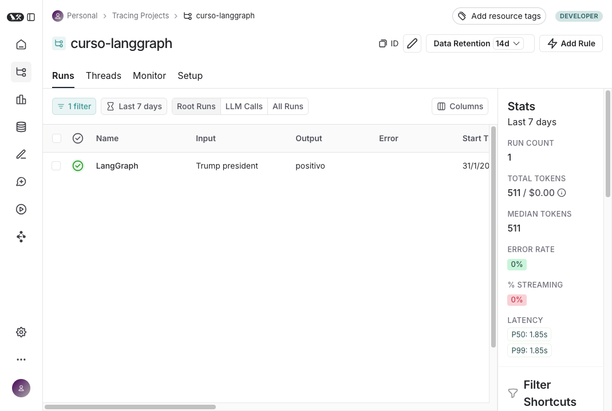
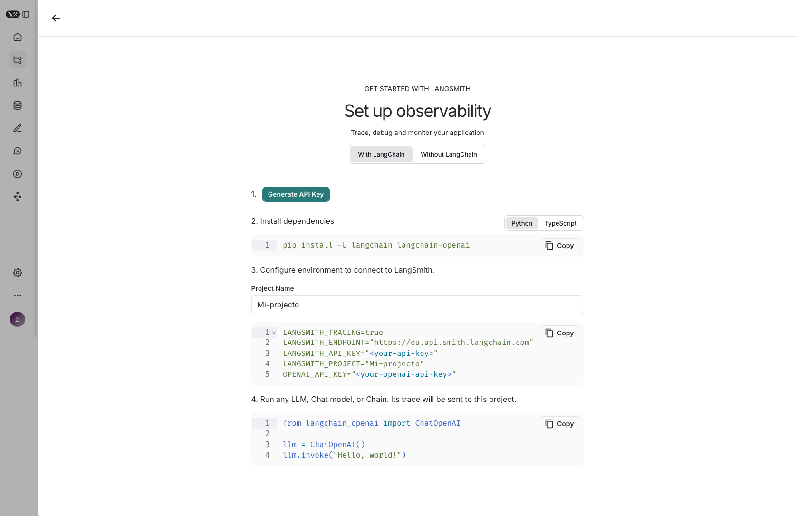
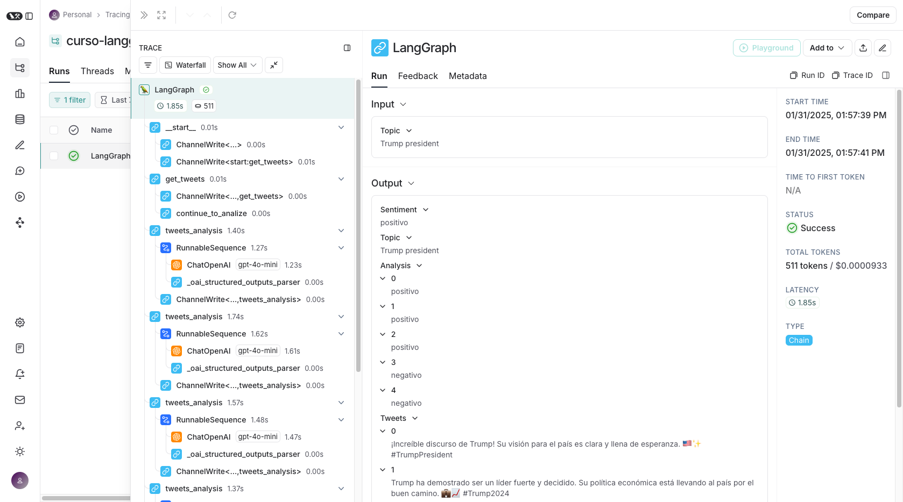

# 🛠️ Tema 9: LangSmith – Analizando y Optimizando Grafos  

## 🌟 ¿Qué es LangSmith?  

[**LangSmith**](https://smith.langchain.com/){target="_blank"} es una plataforma avanzada de depuración y monitoreo diseñada para mejorar la **observabilidad, evaluación y optimización** de modelos de lenguaje y flujos de trabajo en LangGraph.  

🔹 **¿Qué nos permite hacer LangSmith?**  
✅ **Registrar y analizar cada ejecución** de nuestro grafo.  
✅ **Evaluar métricas clave** como tiempos de respuesta y eficiencia del modelo.  
✅ **Depurar errores** y entender mejor las decisiones tomadas por el grafo.  
✅ **Optimizar la lógica de nuestro flujo** mediante un análisis detallado.  

LangSmith actúa como un **registro interactivo** que nos permite inspeccionar la ejecución de nuestros grafos con mayor granularidad, lo que facilita la optimización y el mantenimiento de flujos complejos.  

---

## 🛠️ ¿Por Qué Usar LangSmith?  

Cuando trabajamos con grafos complejos que involucran múltiples modelos de lenguaje, herramientas y flujos condicionales, **es crucial contar con una herramienta que nos ayude a rastrear y analizar cada paso del proceso**.  

LangSmith nos permite:  
✅ **Auditar y depurar fallos** en la ejecución de modelos y flujos de datos.  
✅ **Identificar cuellos de botella** y optimizar la eficiencia del sistema.  
✅ **Comparar diferentes versiones de un mismo grafo** para elegir la más efectiva.  

En resumen, **LangSmith convierte los flujos de trabajo en datos estructurados que podemos analizar para mejorar continuamente nuestras aplicaciones**.  

---

## 📊 ¿Cómo Se Ve LangSmith?  

LangSmith ofrece una interfaz visual que permite explorar ejecuciones previas de nuestros grafos, visualizar métricas clave y analizar cada paso del flujo en detalle.  

📷 *Captura de pantalla de LangSmith en acción*  
  

---

## 🛠️ ¿Cómo Configurar LangSmith?  

Para integrar LangSmith en nuestro flujo de trabajo, primero debemos **configurar las credenciales** y luego **habilitar el seguimiento de logs** en nuestros grafos.  

📌 **Pasos para la configuración:**  
1️⃣ **Crear una cuenta en LangSmith** en [smith.langchain.com](https://smith.langchain.com/).  
2️⃣ **Obtener la API Key** desde el panel de configuración.  
3️⃣ **Configurar la API Key en nuestro entorno**.  
4️⃣ **Integrar LangSmith en nuestro código** para empezar a registrar las ejecuciones.  

 

```python
LANGSMITH_TRACING=true
LANGSMITH_ENDPOINT="https://eu.api.smith.langchain.com"
LANGSMITH_API_KEY="<your-api-key>"
LANGSMITH_PROJECT="Mi-projecto"
OPENAI_API_KEY="<your-openai-api-key>"
```

---

## 🎯 Ejemplo Práctico: Monitoreo de un Grafo con LangSmith  

Veamos cómo podemos conectar un grafo a LangSmith y analizar sus métricas.  

📌 **Pasos:**  
1️⃣ **Definir un grafo** y habilitar la integración con LangSmith.  
2️⃣ **Ejecutar el grafo y analizar su comportamiento en LangSmith.**  
3️⃣ **Visualizar los logs y métricas obtenidas.**  

 

Tras ejecutar nuestro grafo con LangSmith, podremos inspeccionar cada paso del proceso y evaluar cómo se comporta nuestro flujo en términos de eficiencia y precisión.  

---

## ✨ Conclusión  

LangSmith es una herramienta fundamental para cualquier desarrollador que desee mejorar la **transparencia, trazabilidad y rendimiento** de sus grafos en LangGraph.  

✅ Nos permite **auditar y optimizar flujos de trabajo** con datos estructurados.  
✅ Facilita la **identificación de errores y cuellos de botella**.  
✅ Mejora la **eficiencia y la toma de decisiones** en la construcción de modelos de lenguaje.  

Si queremos llevar nuestros grafos al siguiente nivel, **LangSmith nos proporciona la información necesaria para hacerlo de manera precisa y efectiva**. 🚀  

---

## 🎓 ¡Has Completado el Curso 2!  

🎉 **¡Felicidades!** Has finalizado el segundo curso de LangGraph, donde hemos aprendido sobre herramientas avanzadas como **LangGraph Studio**, **paralelismo**, **subgrafos** y **optimización con LangSmith**.  

Hemos visto cómo construir grafos más eficientes, depurarlos y analizar su rendimiento para mejorar nuestras aplicaciones basadas en modelos de lenguaje.  

Pero esto no termina aquí...  

---

## 🚀 ¿Qué Viene en el Curso 3?  

En el próximo curso, llevaremos LangGraph a un nivel aún más profesional. Exploraremos temas como:  
✅ **Memoria a Largo Plazo** para mantener contexto entre sesiones.  
✅ **Almacenamiento en LangGraph Store** para persistencia de datos.  
✅ **Despliegue de grafos en producción** con LangGraph CLI y servidores locales.  

Si estás listo para llevar tus conocimientos al siguiente nivel, **te esperamos en el Curso 3**. ¡Nos vemos allí! 🚀  
