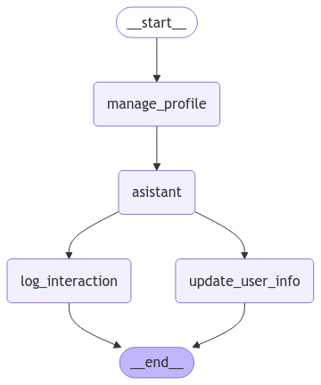

# 🧠 Tema 2: Memory Schema – Estructurando la Memoria en LangGraph  

## 🌟 Introducción  

En el tema anterior, exploramos cómo la **Memoria a Largo Plazo (Long-Term Memory)** nos permite **persistir información** entre sesiones de un grafo.  

Sin embargo, almacenar datos sin una estructura definida puede llevar a **problemas de organización y recuperación de la información**.  

Para solucionar esto, **LangGraph introduce los Memory Schemas**, que nos permiten definir cómo se almacenan y gestionan los datos dentro del sistema de memoria del grafo.  

---

## 🔍 ¿Qué es un Memory Schema?  

Un **Memory Schema** es una forma estructurada de almacenar datos en la memoria del grafo.  
Nos permite:  

✅ **Definir cómo se organiza la información** dentro de la memoria.  
✅ **Garantizar consistencia** en los datos almacenados.  
✅ **Facilitar la recuperación de información** en futuras interacciones.  

LangGraph nos ofrece dos tipos principales de esquemas de memoria:  

1️⃣ **Profile Schema** – Ideal para almacenar información estructurada sobre un usuario.  
2️⃣ **Collection Schema** – Perfecto para gestionar múltiples registros de datos.  

---

## 📌 Profile Schema – Perfil del Usuario  

El **Profile Schema** nos permite estructurar la información de un usuario de manera clara y organizada.  

Esto es útil para **asistentes virtuales, chatbots o sistemas personalizados** que necesitan recordar detalles clave de cada usuario.  

📌 **Ejemplo de uso:**  
- Nombre del usuario  
- Ubicación  
- Intereses  
- Preferencias  

```python
from typing import TypedDict
from langgraph.store.memory import InMemoryStore

# Definimos un esquema de perfil para almacenar información estructurada del usuario
class UserProfile(TypedDict):
    name: str
    location: str
    interests: list[str]

# Creamos una instancia de almacenamiento en memoria
store = InMemoryStore()

# Definimos un usuario con información básica
user_id = "user_123"
profile_data = UserProfile(name="Raúl", location="Barcelona", interests=["Ciclismo", "Tecnología"])

# Guardamos el perfil en la memoria persistente
store.put(namespace=("profile", user_id), key="user_info", value=profile_data)

# Recuperamos la información del usuario
retrieved_profile = store.get(namespace=("profile", user_id), key="user_info")

# Mostramos los datos almacenados
print(retrieved_profile.dict())
```

```python title="Resultado"
{'namespace': ['profile', 'user_123'], 'key': 'user_info', 'value': {'name': 'Raúl', 'location': 'Barcelona', 'interests': ['Ciclismo', 'Tecnología']}, 'created_at': '2025-02-06T09:52:45.865704+00:00', 'updated_at': '2025-02-06T09:52:45.865711+00:00'}
```

En este ejemplo, creamos un esquema de perfil donde el asistente almacena detalles relevantes sobre el usuario, lo que permite ofrecer respuestas más personalizadas en futuras interacciones. 🚀

  
???+ Note "Nota"

    Utilizamos tres elementos clave para almacenar y recuperar datos en memoria:

    🔹 **namespace:** Actúa como una "categoría" o espacio de almacenamiento para organizar mejor los datos. En este caso, usamos `"profile"` para identificar que estamos guardando información de usuario.

    🔹 **key:** Es el identificador único dentro de un `namespace`. Aquí usamos `"user_info"` para hacer referencia al perfil del usuario dentro de la categoría `"profile"`.

    🔹 **value:** Contiene la información real que queremos almacenar, en este caso, el perfil del usuario con su nombre, ubicación e intereses.

    De esta forma, organizamos los datos de manera estructurada y podemos recuperarlos fácilmente cuando sea necesario.


---

## 📌 Collection Schema – Almacenamiento de Múltiples Registros  

El **Collection Schema** es útil cuando necesitamos almacenar **múltiples entradas** organizadas de manera eficiente.  

📌 **Ejemplo de uso:**  
- Historial de interacciones  
- Registro de compras en un e-commerce  
- Logs de asistencia técnica  

A diferencia del Profile Schema, aquí almacenamos **una colección de datos**, permitiendo manejar un **historial de eventos** de forma estructurada.  

```python
from typing import TypedDict
from langgraph.store.memory import InMemoryStore
from datetime import datetime
import uuid

# Definimos un esquema para registrar múltiples eventos
class InteractionLog(TypedDict):
    timestamp: str
    user_message: str
    bot_response: str

# Instanciamos el almacenamiento en memoria
store = InMemoryStore()

# Simulamos interacciones y las almacenamos en una colección de datos
user_id = "user_123"
namespace = ("history", user_id)

# Agregamos entradas al historial de conversación
key = str(uuid.uuid4())
store.put(namespace, key=key, value=InteractionLog(
    timestamp=str(datetime.now()),
    user_message="¿Cuál es la capital de Francia?",
    bot_response="La capital de Francia es París."
))

key = str(uuid.uuid4())
store.put(namespace, key=key, value=InteractionLog(
    timestamp=str(datetime.now()),
    user_message="¿Qué tiempo hace hoy?",
    bot_response="No tengo acceso a datos en tiempo real, pero puedes consultarlo en un servicio meteorológico."
))

# Recuperamos el historial de conversación
chat_history = store.search(namespace)

# Mostramos los mensajes almacenados
for m in chat_history:
    print(m.dict())
```

```python title="Resultado"
{'namespace': ['history', 'user_123'], 'key': '8b7b7f79-45e4-4d63-a890-a2c5120ff991', 'value': {'timestamp': '2025-02-06 10:03:27.270865', 'user_message': '¿Cuál es la capital de Francia?', 'bot_response': 'La capital de Francia es París.'}, 'created_at': '2025-02-06T10:03:27.270936+00:00', 'updated_at': '2025-02-06T10:03:27.270939+00:00', 'score': None}
{'namespace': ['history', 'user_123'], 'key': '72403e77-2919-4eb5-9b1b-ffa4108a9c0f', 'value': {'timestamp': '2025-02-06 10:03:27.271097', 'user_message': '¿Qué tiempo hace hoy?', 'bot_response': 'No tengo acceso a datos en tiempo real, pero puedes consultarlo en un servicio meteorológico.'}, 'created_at': '2025-02-06T10:03:27.271114+00:00', 'updated_at': '2025-02-06T10:03:27.271115+00:00', 'score': None}
```

Este esquema nos permite almacenar y recuperar datos de manera eficiente, facilitando la toma de decisiones basadas en información histórica.  

---

## 🛠️ Implementación Completa  

Ahora combinaremos ambos esquemas en un **grafo funcional**, donde el sistema podrá **gestionar perfiles de usuario y almacenar registros de eventos** dentro del mismo flujo.  

???+ warning "Importante"

    - **El Profile Schema** nos permite definir atributos fijos de un usuario.  
    - **El Collection Schema** es ideal para registrar eventos dinámicos.  
    - **Ambos esquemas pueden coexistir** dentro de una misma implementación de memoria.  

```python
from langgraph.graph import StateGraph, MessagesState, START, END
from langgraph.store.memory import InMemoryStore
from langgraph.store.base import BaseStore
from langgraph.checkpoint.memory import MemorySaver
from langchain_core.messages import HumanMessage, SystemMessage
from langchain_core.runnables.config import RunnableConfig
from langchain_openai import ChatOpenAI
from datetime import datetime
from typing import TypedDict
from typing_extensions import Annotated, TypedDict
from IPython.display import Image
import uuid

# Inicializamos el modelo de lenguaje (LLM) usando GPT-4o-mini 
llm = ChatOpenAI(model="gpt-4o-mini")

MODEL_SYSTEM_MESSAGE = """Eres un asistente útil con memoria que proporciona información personalizada sobre el usuario. 
    Si tienes memoria para este usuario, utilízala para personalizar tus respuestas.
    En caso de no tener memoria o estar incompleta, trata sutilmente, de hacer las preguntas claves para obtener la información necesaria (nombre, lugar de residencia y intereses).
    Aquí está la memoria (puede estar vacía o incompleta): {memory}
"""

UPDATE_MEMORY_INSTRUCTION = """Estás recopilando información sobre el usuario para personalizar tus respuestas.

INFORMACIÓN ACTUAL DEL USUARIO:
{memory}

INSTRUCCIONES:
1. Revisa cuidadosamente el historial de chat a continuación.
2. Identifica nueva información sobre el usuario, como:
   - Datos personales (nombre, ubicación).
   - Intereses y aficiones.
   - Experiencias pasadas.
   - Objetivos o planes futuros.
3. Fusiona cualquier nueva información con la memoria existente.
4. Formatea la memoria con el formato JSON proporcionado.
5. Si la nueva información contradice la memoria existente, conserva la versión más reciente.

Recuerda: Solo incluye información real directamente mencionada por el usuario. No hagas suposiciones ni inferencias.

Basado en el historial de chat a continuación, actualiza la información del usuario:"""

# Definimos los esquemas de memoria
class UserProfile(TypedDict):
    """ Memoria para almacenar el perfil del usuario """
    name: Annotated[str, ..., "Nombre del usuario"] 
    location: Annotated[str, ..., "Lugar de residencia del usuario"]  
    interests: Annotated[list[str],..., "Intereses y aficiones del usuario"]

class InteractionLog(TypedDict):
    timestamp: str
    user_message: str
    bot_response: str

# Función para gestionar la memoria del usuario
def manage_user_profile(state: MessagesState, config: RunnableConfig, store: BaseStore):
    namespace = ("profile", config["configurable"]["user_id"])

    # Intentamos recuperar el perfil existente
    existing_profile = store.get(namespace, key="user_info")

    # Si no hay perfil, creamos uno nuevo
    if not existing_profile:
        profile_data = UserProfile(name="Desconocido", location="Desconocida", interests=[])
        store.put(namespace, key="user_info", value=profile_data)
    return {}

# Función del asistente
def asistant(state: MessagesState, config: RunnableConfig, store: BaseStore):
    namespace = ("profile", config["configurable"]["user_id"])
    user_profile = store.get(namespace, key="user_info")

    system_msg = MODEL_SYSTEM_MESSAGE.format(memory=user_profile.dict())
    response = llm.invoke([SystemMessage(content=system_msg)] + state["messages"])

    return {"messages": [response]}

# Función para actualizar información del usuario
def update_user_info(state: MessagesState, config: RunnableConfig, store: BaseStore):
    namespace = ("profile", config["configurable"]["user_id"])

    # Intentamos recuperar el perfil existente
    existing_profile = store.get(namespace, key="user_info")

    # Le pedimos al llm que examine si hay algún dato que actualizar en nuestra memoria
    system_msg = UPDATE_MEMORY_INSTRUCTION.format(memory=existing_profile.dict())
    llm_structured = llm.with_structured_output(UserProfile)
    response = llm_structured.invoke([SystemMessage(content=system_msg)] + state["messages"])

    print(response)

    # Actualizamos la información del usuario
    store.put(namespace,
              key="user_info",
              value=UserProfile(
                  name=response.get('properties').get('name'),
                  location=response.get('properties').get('location'),
                  interests=response.get('properties').get('interests')
                  )
              )
    
    return {}

# Función para almacenar el historial de interacciones
def log_interaction(state: MessagesState, config: RunnableConfig, store: BaseStore):
    namespace = ("history", config["configurable"]["user_id"])

    # Extraemos el último mensaje del usuario y la respuesta de la IA
    user_message = state["messages"][-2].content if len(state["messages"]) > 1 else "No disponible"
    bot_response = state["messages"][-1].content if len(state["messages"]) > 0 else "No disponible"

    # Guardamos la interacción en la memoria persistente
    store.put(namespace, key="chat_history", value=InteractionLog(
        timestamp=str(datetime.now()),
        user_message=user_message,
        bot_response=bot_response
    ))
    return {}

# Creamos el grafo
builder = StateGraph(MessagesState)
builder.add_node("manage_profile", manage_user_profile)
builder.add_node("log_interaction", log_interaction)
builder.add_node("asistant", asistant)
builder.add_node("update_user_info", update_user_info)

# Definimos la estructura del flujo
builder.add_edge(START, "manage_profile")
builder.add_edge("manage_profile", "asistant")
builder.add_edge("asistant", "update_user_info")
builder.add_edge("asistant", "log_interaction")
builder.add_edge(["update_user_info","log_interaction"], END)

# Almacenamiento para la memoria a largo plazo (entre sesiones)
across_thread_memory = InMemoryStore()

# Checkpointer para la memoria a corto plazo (dentro de una sesión)
within_thread_memory = MemorySaver()

# Compilamos el grafo con el almacenamiento
graph = builder.compile(checkpointer=within_thread_memory, store=across_thread_memory)
Image(graph.get_graph().draw_mermaid_png())
```



Ejecutamos el grafo.

```python
# Proporcionamos un ID de hilo para la memoria a corto plazo (dentro de la sesión)
# Proporcionamos un ID de usuario para la memoria a largo plazo (entre sesiones)
config = {"configurable": {"thread_id": "1", "user_id": "cd3f791a-0a0c-4ea4-bb28-ea5176bd4450"}}
# Entrada del usuario 
input_messages = [HumanMessage(content="Hola, me llamo Raúl y me gusta salir en bici.")]

# Ejecutamos el grafo y mostramos la respuesta del chatbot
for chunk in graph.stream({"messages": input_messages}, config, stream_mode="values"):
    chunk["messages"][-1].pretty_print()
```

```python title="Resultado"
================================ Human Message =================================

Hola, me llamo Raúl y me gusta salir en bici.
================================== Ai Message ==================================

¡Hola, Raúl! Es genial conocerte. Salir en bici es una actividad muy divertida y saludable. ¿Tienes rutas favoritas para recorrer en bicicleta? ¿O quizás alguna otra actividad que te guste?
```

Resvisamos la información generada y almacenada en nuestra memoria.

```python
retrieved_profile = across_thread_memory.get(namespace=("profile", "cd3f791a-0a0c-4ea4-bb28-ea5176bd4450"), key="user_info")
print(retrieved_profile.dict())
```

```json title="Resultado" hl_lines="7-13"
{
   "namespace":[
      "profile",
      "cd3f791a-0a0c-4ea4-bb28-ea5176bd4450"
   ],
   "key":"user_info",
   "value":{
      "name":"Raúl",
      "location":"Desconocida",
      "interests":[
         "salir en bici"
      ]
   },
   "created_at":"2025-02-06T12:38:08.354512+00:00",
   "updated_at":"2025-02-06T12:38:08.354519+00:00"
}
```


En este ejemplo, el grafo gestiona **perfiles de usuario** y almacena **un historial de interacciones**, permitiendo un manejo estructurado y eficiente de la memoria.  

---

## ✨ Conclusión  

Los Memory Schemas nos permiten **estructurar y gestionar la información** dentro de la memoria de LangGraph de manera eficiente.  

✅ **El Profile Schema** es ideal para **atributos estáticos** del usuario.  
✅ **El Collection Schema** nos ayuda a **almacenar múltiples eventos organizados**.  
✅ **Ambos pueden combinarse** para crear memorias más completas y funcionales.  

🚀 Con estas herramientas, podemos construir **sistemas más inteligentes y personalizados**, optimizando la experiencia del usuario.  

---

## 🧑‍🏫 ¿Qué Hemos Aprendido?  

- **Cómo estructurar la memoria en LangGraph usando Profile y Collection Schema.**  
- **Diferencias y casos de uso de ambos esquemas.**  
- **Implementación de memoria estructurada en un grafo real.**  

---

---

## 🔎 Recursos:

- :simple-googlecolab: Ver notebook en [Google Colab](https://colab.research.google.com/drive/16ReKOrfytiTZi9-FAV55vugWrseZuthm?usp=sharing)
- :books: Definición: [Memory](https://langchain-ai.github.io/langgraph/concepts/memory/#long-term-memory)
- :books: Definición: [Memory-store](https://langchain-ai.github.io/langgraph/concepts/persistence/#memory-store)
- :material-code-tags: Class: [BaseStore](https://langchain-ai.github.io/langgraph/reference/store/#langgraph.store.base.BaseStore)
- :material-wikipedia: Wikipedia: [Semantic-memory](https://es.wikipedia.org/wiki/Memoria_sem%C3%A1ntica)

---
## 🌐 ¿Qué es lo Siguiente?  

En el próximo tema, exploraremos **LangGraph Store**, donde veremos cómo almacenar y recuperar información de memoria a nivel avanzado.  