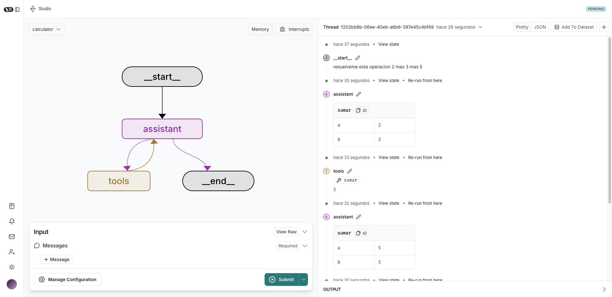
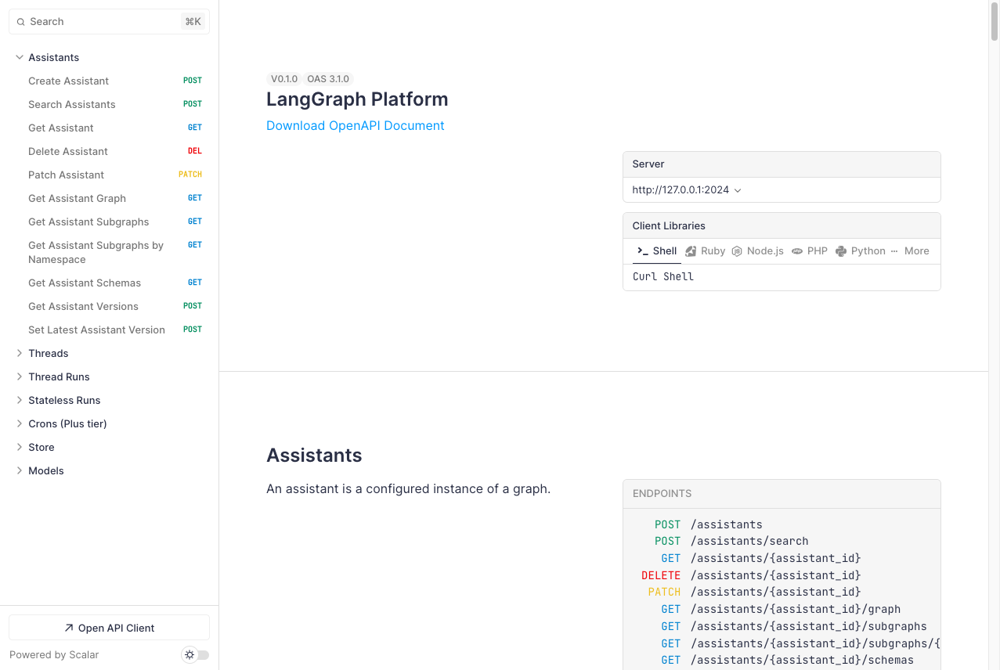

# ⚙️ Tema 4: LangGraph CLI – Comandos y Uso  

## 🚀 ¿Qué es LangGraph CLI?  

**LangGraph CLI** es una herramienta de línea de comandos que facilita la creación, ejecución y despliegue de servidores de LangGraph.  
Con esta interfaz, podemos gestionar nuestros proyectos sin necesidad de escribir código manualmente.  

## 🛠️ Instalación de LangGraph CLI  

Para comenzar a usar **LangGraph CLI**, primero debemos instalarlo en nuestro entorno de desarrollo.  

📌 **Instalación:**  

```bash
pip install -U langgraph-cli
```  

???+ warning "Atención"  
    Para utilizar **`langgraph dev`**, es necesario instalar dependencias adicionales. Usa el siguiente comando:  
    ```bash
    pip install -U "langgraph-cli[inmem]"
    ``` 

---

## 📝 **Comandos Principales de LangGraph CLI**  

| Comando | Descripción |
|---------|------------|
| **`langgraph new`**  | 🌱 Crea un nuevo proyecto de LangGraph a partir de una plantilla. |
| **`langgraph build`**  | 📦 Genera una imagen Docker lista para desplegar el servidor. |
| **`langgraph up`**  | 🚀 Inicia el servidor de LangGraph en producción. |
| **`langgraph dev`**  | 🏃‍♀️ Ejecuta el servidor en **modo desarrollo**, con recarga automática. |
| **`langgraph dockerfile`**  | 🐳 Genera un **Dockerfile** personalizado para el servidor. |

Cada uno de estos comandos cumple una función específica dentro del ciclo de vida de un proyecto de LangGraph.  

---

## 🎯 **¿Cuándo Usar Cada Comando?**  

Dependiendo del entorno en el que estemos trabajando, podemos utilizar diferentes comandos para ejecutar LangGraph.  
Distinguimos dos modos principales: **desarrollo** y **producción**.  

### 🔹 **Modo Desarrollo (Testing y Pruebas Rápidas)**  

📌 Para ejecutar un servidor en **modo desarrollo**, sin necesidad de Docker y con recarga automática:  
 
```bash
langgraph dev --port 2024 # El puerto no es necesario pero si os falla por defecto probad este.
```  

```bash title="Resultado"
INFO:langgraph_api.cli:

        Welcome to

╦  ┌─┐┌┐┌┌─┐╔═╗┬─┐┌─┐┌─┐┬ ┬
║  ├─┤││││ ┬║ ╦├┬┘├─┤├─┘├─┤
╩═╝┴ ┴┘└┘└─┘╚═╝┴└─┴ ┴┴  ┴ ┴

- 🚀 API: http://127.0.0.1:2024
- 🎨 Studio UI: https://smith.langchain.com/studio/?baseUrl=http://127.0.0.1:2024
- 📚 API Docs: http://127.0.0.1:2024/docs

This in-memory server is designed for development and testing.
For production use, please use LangGraph Cloud.
```

???+ example "Ejemplo"  
    Si estamos creando un chatbot en LangGraph y queremos probar cambios sin reiniciar manualmente, usaremos `langgraph dev`.  

Cuando ejecutamos este comando, se generan tres puntos clave de interacción:  

- **API:** URL local para realizar llamadas directas a nuestro grafo mediante peticiones HTTP.  
- **Studio UI:** Interfaz gráfica accesible desde el navegador que permite visualizar y depurar nuestro grafo sin necesidad de instalar herramientas adicionales.  



- **API Docs:** Documentación interactiva de la API, donde podemos explorar los endpoints disponibles junto con ejemplos de uso.  



Esto facilita la experimentación y depuración en tiempo real, haciendo más ágil el desarrollo.  

???+ warning "Atención"  
    Es posible que, en la primera ejecución, se presenten errores relacionados con la conexión a **LangSmith** o la configuración de la clave de **OpenAI**.  
      
    Para solucionarlo, es recomendable instalar **python-dotenv**:  
    ```bash
    pip -U install python-dotenv
    ```
    Luego, debemos crear un archivo **`.env`** en la carpeta del proyecto con las credenciales necesarias:  
    ```bash
    OPENAI_API_KEY="<CLAVE_OPENAI>"
    LANGSMITH_API_KEY="<CLAVE_LANGSMITH>"
    #LANGCHAIN_ENDPOINT="https://eu.api.smith.langchain.com/" # Descomenta esta linea si usas el servidor de EU
    LANGSMITH_PROJECT="<NOMBRE_PROYECTO>"
    ```
    ⚠ **IMPORTANTE:** Nunca subas el archivo **`.env`** al repositorio para evitar exponer información sensible.  

???+ Note "Nota"  

    Un beneficio adicional de este comando es que se sincroniza automáticamente con tu cuenta de LangSmith, lo que permite rastrear y analizar el flujo de ejecución de tu grafo en tiempo real.  


---

### 🔹 **Modo Producción (Despliegue Final)**  

📌 Para construir una imagen de **Docker** antes de desplegar:  

```bash
langgraph build 
``` 

📌 Para generar un **Dockerfile** personalizado:  

```bash
langgraph dockerfile 
``` 

📌 Para levantar el servidor en producción:  
 
```bash
langgraph up
``` 

???+ quote "Recomendación"  
    - **Usa `langgraph up`** si deseas ejecutar el servidor sin Docker.  
    - **Usa `langgraph build` y `dockerfile`** si prefieres un despliegue más controlado con Docker.  

---

## 🛠️ **Ejemplo Práctico: Creando y Ejecutando un Servidor**  

Veamos un flujo de trabajo común para crear y ejecutar un servidor con LangGraph CLI.  

### 1️⃣ **Creamos un nuevo proyecto:**  
  
```bash
langgraph new mi_proyecto && cd mi_proyecto
``` 

### 2️⃣ **Ejecutamos el servidor en modo desarrollo:**  
 
```bash
langgraph dev --port 2024
``` 

### 3️⃣ **Si todo funciona bien, lo preparamos para producción:**  

```bash
langgraph build -t calculator # -t: El nombre de la imagen que se generará
``` 

```bash title="Resultado" hl_lines="3"
(langgraph) > langgraph-server % docker images
REPOSITORY                  TAG       IMAGE ID       CREATED              SIZE
calculator                  latest    f13bafae5b87   About a minute ago   897MB
```

```bash
langgraph dockerfile --add-docker-compose -c langgraph.json ./dockerfile
``` 

```bash title="Resultado"
🔍 Validating configuration at path: /Users/tu-usuario/langgraph-server/langgraph.json
✅ Configuration validated!
📝 Generating Dockerfile at /Users/tu-usuario/langgraph-server/dockerfile
✅ Created: Dockerfile
✅ Created: .dockerignore
✅ Created: docker-compose.yml
➖ Skipped: .env. It already exists!
🎉 Files generated successfully at path /Users/tu-usuario/langgraph-server!
```

### 4️⃣ **Levantamos el servidor en producción:**  
 
```bash
langgraph up -p 8800 # Podeis ajustar el puerto al que mejor os funcione.
``` 

```bash title="Resultado"
Starting LangGraph API server...
For local dev, requires env var LANGSMITH_API_KEY with access to LangGraph Cloud closed beta.
For production use, requires a license key in env var LANGGRAPH_CLOUD_LICENSE_KEY.
Ready!       
- API: http://localhost:8800
- Docs: http://localhost:8800/docs
- LangGraph Studio: https://smith.langchain.com/studio/?baseUrl=http://127.0.0.1:8800
```


📌 **¡Y listo!** Con estos pasos, hemos pasado de desarrollo a producción con LangGraph CLI.  

---

## ✨ Conclusión  

LangGraph CLI nos permite gestionar fácilmente nuestros servidores sin necesidad de configuraciones manuales.  

✅ Nos ayuda a **crear y estructurar proyectos de LangGraph rápidamente.**  
✅ Facilita la **ejecución en entornos de desarrollo y producción.**  
✅ Permite **desplegar servidores de forma eficiente con Docker.**  

Si trabajamos con **grafos complejos**, esta herramienta se vuelve **esencial** para simplificar el proceso de desarrollo y despliegue. 🚀  

---

## 🧑‍🏫 **¿Qué Hemos Aprendido?**  

- **Cómo instalar y usar LangGraph CLI en distintos entornos.**  
- **Qué comandos usar para desarrollo y producción.**  
- **Cómo ejecutar y desplegar un servidor de LangGraph.**  

---

## 🌐 **¿Qué es lo Siguiente?**  

En el próximo tema, exploraremos **LangGraph SDK**, la herramienta que nos permitirá conectar, ejecutar y administrar grafos de manera programática.  
Aprenderemos a interactuar con nuestros grafos desde código, gestionar ejecuciones (*runs*) y aprovechar funcionalidades avanzadas como *streaming* e *intervención humana*.  