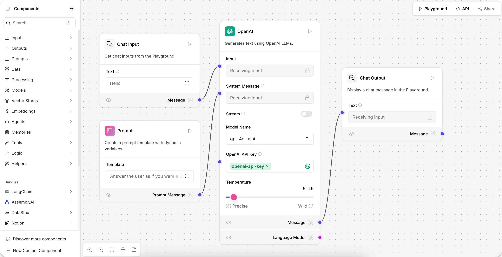
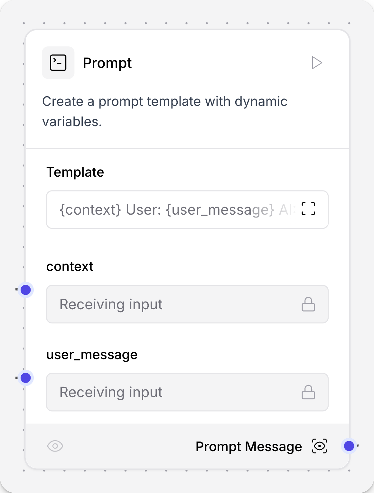
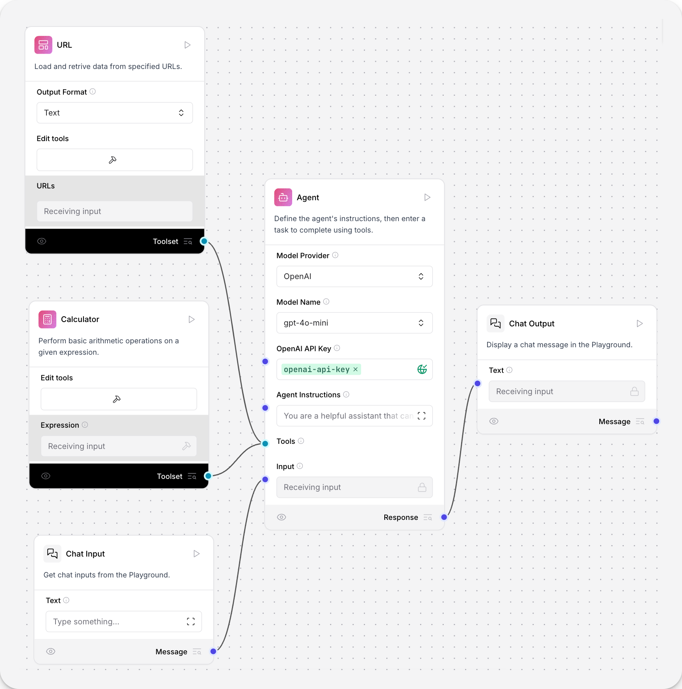
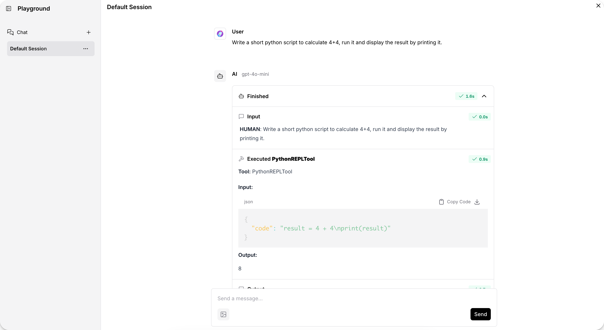

# 🖥️ Tema 8: Langflow  

## 🌟 Introducción  

En este tema, exploraremos **Langflow**, una herramienta de bajo código diseñada para facilitar la creación de agentes de inteligencia artificial y flujos de trabajo complejos.  

Langflow permite a los desarrolladores integrar **modelos de lenguaje, APIs y bases de datos** de manera intuitiva, acelerando el desarrollo de aplicaciones basadas en IA.  

{ loading=lazy }

---

## 🔎 ¿Qué es Langflow?  

Langflow es una plataforma que ofrece una **interfaz gráfica** para construir aplicaciones de IA mediante **componentes reutilizables**.  

Cada componente representa una unidad funcional, como:  
✅ Un modelo de lenguaje  
✅ Una fuente de datos  
✅ Una herramienta externa  

Estos componentes se pueden **conectar entre sí** para formar flujos de trabajo completos.  

???+ example "Ejemplo de uso"  
    Un usuario puede arrastrar un modelo GPT, conectarlo con una base de datos y definir reglas para responder preguntas con información actualizada.  

---

## 🛠️ ¿Cómo se utiliza Langflow?  

Para utilizar Langflow, sigue estos pasos:  

1️⃣ **Creación de Flujos** 🏗️  
   - Arrastra y suelta componentes desde la barra lateral al espacio de trabajo.  
   - Construye el flujo visualmente.  

{ loading=lazy }

2️⃣ **Configuración de Componentes** ⚙️  
   - Haz clic en un componente para modificar su configuración.  
   - Puedes ajustar los parámetros y ver el código Python subyacente.  

{ width="300", loading=lazy }

3️⃣ **Conexión de Componentes** 🔗  
   - Une los componentes para definir el flujo de datos.  
   - Determina el orden y la lógica del procesamiento.  

{ loading=lazy }

4️⃣ **Ejecución del Flujo** ▶️  
   - Ejecuta el flujo desde la interfaz y observa los resultados en tiempo real.  

{ loading=lazy }

???+ note "Nota"  
    Langflow permite exportar el código generado para su uso en otros entornos.  

---

## 🎯 ¿Para qué sirve Langflow?  

Langflow es útil para:  

- 🚀 **Prototipado rápido** – Crear y probar flujos de trabajo de IA sin escribir código desde cero.  
- 👀 **Visualización de flujos** – Representar gráficamente la lógica de la aplicación para facilitar su comprensión.  
- 🔌 **Integración sencilla** – Incorporar modelos de lenguaje, APIs y bases de datos en una plataforma única.  

???+ tip "Consejo"  
    Langflow es ideal para **desarrolladores y no programadores** que desean experimentar con IA de forma visual.  

---

## 🔗 Integración de Langflow con LangGraph  

Langflow se integra perfectamente con **LangGraph**, una herramienta que permite construir flujos de trabajo complejos mediante programación.  

💡 **¿Cómo trabajan juntos?**  

| **Función**   | **Langflow** 🖥️ | **LangGraph** 🧩 |
|--------------|----------------|------------------|
| **Diseño Visual** 🎨 | ✅ Sí | ❌ No |
| **Automatización** ⚙️ | ✅ Limitada | ✅ Avanzada |
| **Ejecución en Producción** 🚀 | 🔶 No recomendado | ✅ Sí |
| **Control de Flujo** 🔄 | 🟡 Básico | ✅ Completo |

🔹 **Casos de uso combinados:**  
✅ **Diseñar agentes en Langflow** y luego exportarlos para ejecutarlos con LangGraph.  
✅ **Probar flujos visualmente** antes de escribir código en LangGraph.  
✅ **Monitorear el comportamiento de un grafo** mediante una interfaz gráfica.  

???+ note "Nota"  
    Si quieres desplegar una aplicación con flujos de IA robustos, **combinar Langflow y LangGraph es una excelente opción**.  

---

## 📚 Recursos Adicionales  

📖 **Documentación Oficial de Langflow**  
🔗 [Langflow Docs](https://docs.langflow.org/concepts-overview)  

📖 **Comparativa entre LangGraph, LangChain, LangFlow y LangSmith**  
🔗 [Medium: LangGraph vs LangChain](https://medium.com/@monsuralirana/langgraph-vs-langchain-vs-langflow-vs-langsmith-which-one-to-use-why-69ee91e91000)  

---

## 🎓 ¡Has Completado el Curso 3!  

🎉 **¡Felicidades! Has finalizado el tercer curso de LangGraph**, donde exploramos la memoria a largo plazo, el almacenamiento de datos con Store, el uso de LangGraph CLI, la conexión con nuestro grafo mediante el SDK de Python y el poderoso LangFlow.  

---

## 🏆 ¿Has Completado Todo el Curso de LangGraph?  

🥳 ¡Enhorabuena! Con esto, concluyes el curso completo de LangGraph, donde pasaste de principiante a experto en la creación de grafos inteligentes.  

Ahora tienes el conocimiento necesario para desarrollar un **asistente virtual** funcional que:  

✅ ⁠Gestiona múltiples consultas con LLMs.  
✅ ⁠Mantiene memoria y contexto de conversaciones previas.  
✅ ⁠Ejecuta tareas en paralelo y maneja flujos complejos.  
✅ ⁠Es capaz de desplegarse y escalar en entornos de producción.  
✅ ⁠Aprovecha herramientas clave del ecosistema LangChain, como LangStudio, LangSmith y LangGraph CLI.  

---

## 🤔 ¿Y Ahora Qué?  

Ahora es el momento de aplicar lo aprendido y construir tus propios grafos profesionales.  

Aunque este curso ha llegado a su fin, **seguiré agregando nuevos temas en el Curso 4**. Exploraremos técnicas avanzadas y profundizaremos en aspectos que no pudimos abordar completamente en este curso. ¡No olvides volver para descubrir las novedades!  

**Te deseo mucho éxito en esta nueva aventura.** 🚀  

Si este curso te ha sido útil y **`quieres apoyar su desarrollo, considera hacer una donación`**. ¡Tu apoyo me ayuda a seguir creando más contenido! (Pronto añadiré opciones para contribuir)
