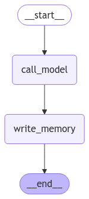

# 🧠 Cápsula 4: LangMem SDK — Memoria a Largo Plazo para Agentes

## 🎯 ¿Qué es LangMem?

**LangMem** es un SDK que ayuda a tus agentes a aprender y adaptarse con el tiempo mediante **memoria a largo plazo**. Proporciona herramientas para:

- 🧩 Extraer información importante de las conversaciones.
- ✍️ Actualizar el comportamiento del agente mediante mejoras del prompt (memoria procedimental).
- 🗂️ Mantener recuerdos persistentes (hechos, preferencias, eventos) entre sesiones.

Funciona con cualquier sistema de almacenamiento y se integra de forma nativa con la **capa de memoria de LangGraph (BaseStore)**. Esto permite que tus agentes sean más personales, consistentes y “aprendan” de sus interacciones.

!!! info "Lecturas clave" 
    - Blog de lanzamiento del SDK: <https://blog.langchain.dev/langmem-sdk-launch/>{target="\_blank"} 
    - Documentación (Key features + Quickstarts): <https://langchain-ai.github.io/langmem/>{target="\_blank"}
    - API de herramientas de memoria: <https://langchain-ai.github.io/langmem/reference/tools/>{target="\_blank"}

### 🧭 Relación con los tipos de memoria del curso

En el curso ya vimos la diferencia entre:

- 🟡 **Memoria a corto plazo** (checkpointing dentro del hilo)
- 🔵 **Memoria a largo plazo** (persistente entre sesiones)

Además, distinguimos 3 “sabores” de memoria a largo plazo:

- 🧠 **Semántica (facts)**: datos y preferencias del usuario, conocimiento atemporal.
- 🧪 **Episódica (experiencias)**: ejemplos o resúmenes de interacciones pasadas.
- ⚙️ **Procedimental (comportamiento)**: reglas y pautas del agente que evolucionan.

LangMem ofrece herramientas listas para implementar estas memorias sobre la capa de almacenamiento de LangGraph, y se complementa con la memoria de corto plazo del grafo.



> Como vimos en “Long-Term Memory”, LangMem encaja como la capa que persiste recuerdos entre sesiones, mientras que `MemorySaver` mantiene el historial dentro de un hilo activo.

---

## 🧠 ¿Para qué podemos usarlo? (Casos de uso)

- 👤 Personalización: recordar preferencias del usuario (p. ej., “prefiero modo oscuro”).
- 🗃️ Perfiles y contexto: construir y mantener fichas de usuario o equipo.
- 🧭 Recuperación contextual: buscar recuerdos relevantes para responder mejor.
- 🔁 Mejora continua: ajustar instrucciones del agente según su rendimiento.
- 🤝 Colaboración: compartir memorias entre agentes o por equipos (namespaces).

---

## 📦 Instalación

```bash
pip install -U langmem
```

Configura la clave del proveedor de LLM (ejemplo con Anthropic):

```bash
export ANTHROPIC_API_KEY="sk-..."
```

!!! tip "Almacenamiento" 
    - Desarrollo: `InMemoryStore` (en memoria, se pierde al reiniciar). 
    - Producción: almacenes persistentes como `AsyncPostgresStore` u otros compatibles con `BaseStore`.

---

## 🕹️ ¿Cómo se usa? (Paso a paso)

A continuación verás cómo añadir memoria persistente a un agente de LangGraph usando las herramientas de LangMem. La idea clave es que el agente pueda:

1. crear/actualizar/borrar recuerdos cuando haga falta, y
2. buscar recuerdos relevantes durante el chat.

### 1) Preparar el Store y Namespaces

Los recuerdos se guardan en un `BaseStore` y se organizan por `namespace`. Es habitual incluir un identificador de usuario para evitar mezcla de memorias.

```python
from langgraph.store.memory import InMemoryStore

store = InMemoryStore(
    index={
        "dims": 1536,
        "embed": "openai:text-embedding-3-small",
    }
)

# El namespace final puede formarse con valores configurables a runtime.
# Ej.: ("memories", "<user-id>")
```

!!! note "Namespaces dinámicos"
    Puedes usar placeholders como `{langgraph_user_id}` y rellenarlos con `config={"configurable": {"langgraph_user_id": "user-123"}}`.

### 2) Herramientas de memoria (LangMem)

LangMem provee dos herramientas principales:

- 🛠️ `create_manage_memory_tool(...)`: crea/actualiza/borra recuerdos.
- 🔎 `create_search_memory_tool(...)`: busca recuerdos por similitud o filtros.

```python
from langmem import create_manage_memory_tool, create_search_memory_tool

manage_memory = create_manage_memory_tool(
    namespace=("memories", "{langgraph_user_id}"),
)

search_memory = create_search_memory_tool(
    namespace=("memories", "{langgraph_user_id}"),
)
```

!!! info "Contrato de `manage_memory`"
    - `content: str | None` — contenido del recuerdo (crear/actualizar) 
    - `id: str | None` — id de un recuerdo existente (actualizar/borrar) 
    - `action: Literal["create","update","delete"]` — acción a realizar

### 3) Crear un agente con memoria

Puedes incorporar estas herramientas en un agente preconstruido de LangGraph (p. ej. ReAct) y pasarle el `store`:

```python
from langgraph.prebuilt import create_react_agent

agent = create_react_agent(
    model="anthropic:claude-3-5-sonnet-latest",
    tools=[manage_memory, search_memory],
    store=store,
)
```

### 4) Guardar y recuperar recuerdos en el “hot path”

El propio LLM decide cuándo llamar a las herramientas (no necesitas comandos especiales). Si el usuario dice algo relevante, el agente puede invocar `manage_memory` para guardarlo; y si necesita contexto pasado, `search_memory` para encontrarlo.

```python
# El agente decide guardar una preferencia
agent.invoke({
    "messages": [{"role": "user", "content": "Recuérdame en el futuro que prefiero el modo oscuro."}]
}, config={"configurable": {"langgraph_user_id": "user-123"}})

# Más tarde, el agente puede recuperar ese dato
resp = agent.invoke({
    "messages": [{"role": "user", "content": "¿Cuáles son mis preferencias de iluminación?"}]
}, config={"configurable": {"langgraph_user_id": "user-123"}})
print(resp["messages"][-1].content)
# → "Me comentaste que prefieres el modo oscuro."
```

!!! tip "Memoria procedimental"
    LangMem también incluye utilidades para **optimizar prompts** (p. ej., `metaprompt`, `gradient`). Sirven para ajustar reglas del agente a partir de conversaciones exitosas o fallidas.

### 5) Background memory manager (opcional)

Además del uso “en caliente”, puedes correr un **gestor en background** que procese conversaciones, consolide recuerdos y mantenga consistencia sin bloquear la interacción.

- Guía “Background Quickstart”: <https://langchain-ai.github.io/langmem/background_quickstart/>{target="\_blank"}

---

## ✅ Ventajas

- 🧩 API simple y portable; funciona con cualquier `BaseStore`.
- 🔌 Integración nativa con la memoria persistente de LangGraph.
- 🤖 Agentes más **personalizados** y **consistentes** entre sesiones.
- 🔍 Búsqueda semántica de recuerdos para mejores respuestas.
- ♻️ Mejora continua del comportamiento mediante optimización del prompt.

---

## 🧪 Lo aprendido

- Qué es LangMem y cómo se relaciona con los tipos de memoria del curso.
- Cómo instalarlo y configurarlo con un `BaseStore` y namespaces.
- Cómo usar sus herramientas (`manage_memory` y `search_memory`) en el “hot path”.
- Qué opciones hay para mantenimiento en background y optimización del prompt.

---

## 🔎 Recursos

- 📰 Blog (lanzamiento): <https://blog.langchain.dev/langmem-sdk-launch/>{target="\_blank"}
- 📘 Docs (inicio): <https://langchain-ai.github.io/langmem/>{target="\_blank"}
- 🧰 Memory Tools API: <https://langchain-ai.github.io/langmem/reference/tools/>{target="\_blank"}
- ⚡ Hot Path Quickstart: <https://langchain-ai.github.io/langmem/hot_path_quickstart/>{target="\_blank"}
- 🧠 Background Quickstart: <https://langchain-ai.github.io/langmem/background_quickstart/>{target="\_blank"}
- 🏗️ BaseStore (LangGraph): <https://langchain-ai.github.io/langgraph/reference/store/>{target="\_blank"}
- 📚 Conceptos de Memoria (LangGraph): <https://langchain-ai.github.io/langgraph/concepts/memory/>{target="\_blank"}
